# MoneyBox

This document provides a detailed walkthrough for the **Capture the Flag (CTF)** challenge published on [**VulnHub**](https://www.vulnhub.com/entry/moneybox-1,653/) by **"Kirthik_T"**.
According to the author, the difficulty of this CTF is **EASY**, and the goal is to gain **root access** to the target machine and find the **flag files**.

To complete this CTF, you should have **basic Linux command knowledge** and **skills with penetration testing tools**.
You can download the original CTF image [here](https://download.vulnhub.com/moneybox/MoneyBox.ova).

> ⚠️ **Note**: All virtual machines were run using [**Oracle VirtualBox**](https://www.virtualbox.org/).
> For the CTF walkthrough we used [**Kali Linux**](https://www.kali.org/docs/introduction/download-official-kali-linux-images/) as the attacking machine.
> The techniques used are **strictly for educational purposes only**.
> **Any liability for applying them against other targets is governed by applicable law.**

---

MoneyBox from the Offensive Security range is a medium-difficulty machine designed for training, network hardening validation, and privilege configuration.
The challenge is of medium complexity and provides a comprehensive exercise to sharpen penetration testing skills with realistic scenarios and attack vectors.
In this task, we start with reconnaissance to identify open ports and available services, move on to identifying vulnerabilities, and finally exploit those vulnerabilities to gain root.
We conclude with recommendations to improve the resilience and robustness of the virtual machine.

## **Brief Overview of the CTF Steps**
1. Download and start the target machine and the attacker toolkit.
2. Obtain the **IP address of the target machine** using **netdiscover**.
3. Scan **open ports** with **nmap**.
4. Investigate the **FTP service** on port 21.
5. Download and inspect an image.
6. Investigate the **HTTP service** on port 80. Enumerate the web server’s filesystem and find hidden files and folders.
7. Locate the image and extract hidden data.
8. Analyze the hidden data. Identify vulnerabilities in the target system.
9. Prepare a wordlist file.
10. Investigate user accounts. Determine their passwords.
11. Find sensitive files on the target host. Analyze them for useful information.
12. Inspect other users’ files on the system.
13. Explore privilege escalation paths. Gain **root access** to the target system.

---

## **CTF Walkthrough Step by Step**

### **Step 1: Boot the target VMs in VirtualBox**
Start the **Kali Linux** image in **VirtualBox** with a terminal window<br>


and the target machine (MoneyBox) for the assessment<br>
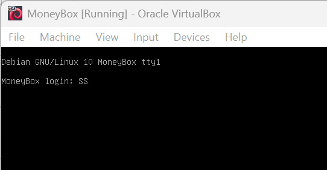

---

### **Step 2: Identify the target’s IP address with netdiscover**
After booting the target VM in **VirtualBox**, first determine its IP address. Run:

```sh
sudo netdiscover
```

📌 **Result**:
We obtained the target machine IP — **192.168.6.147**.<br>
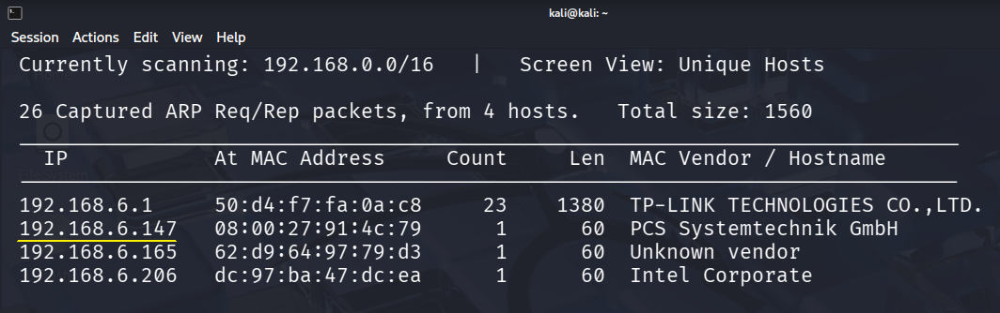

⚠️ **Note**: The IPs of the attacker and target machines may differ depending on your network configuration.

---

### **Step 3: Scan open ports using nmap**
Use nmap to scan the discovered IP for **open ports** and **running services**. The **-A** switch enables aggressive scanning, which performs:
- **OS detection** to determine the target’s operating system;
- **version detection** for services on open ports;
- **default script scanning** to collect additional information;
- **traceroute** to show the network path to the target.

```sh
nmap -A 192.168.6.147
```

📌 **Result**:
- Port **21 (FTP)** open.
- Port **22 (SSH)** open.
- Port **80 (HTTP, Apache Server)** open.<br>
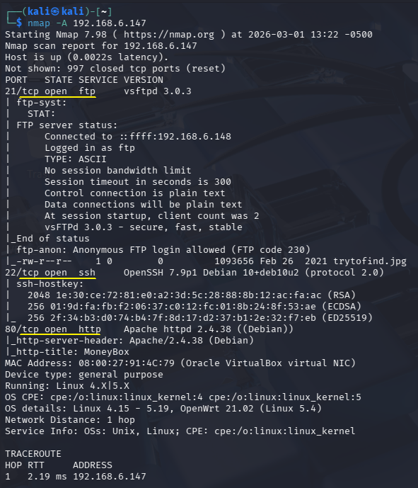

We will examine these ports next.

---

### **Step 4: Check FTP accessibility on port 21**
We identified an FTP service on port 21 that allows anonymous login.
Let’s connect using **anonymous** as the username and leave the password blank:

```sh
ftp 192.168.6.147
ls
```

📌 **Result**:
We successfully logged in via FTP and used **ls** to view directory contents.<br>
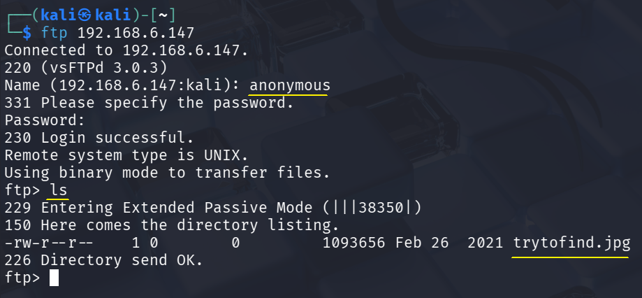

---

### **Step 5: Download and inspect the image**
The directory contains **trytofind.jpg** (~1 MB).
Download it for analysis:

```sh
get trytofind.jpg
quit
```

📌 **Result**:
The image was downloaded to our **Kali** machine, and we exited the **FTP** console with **quit**.<br>
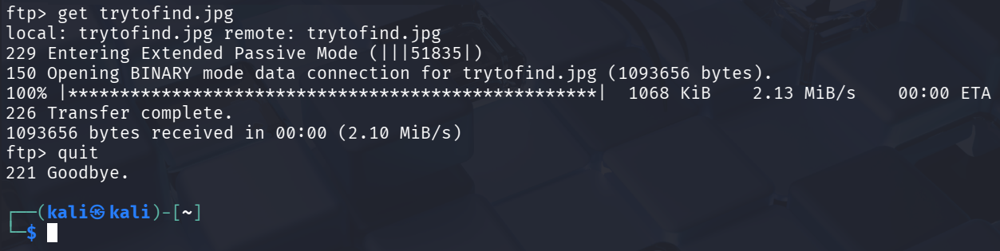

Open the image from the home folder.
Click the folder icon on the desktop and choose **Open Folder**.
Locate **trytofind.jpg**.<br>
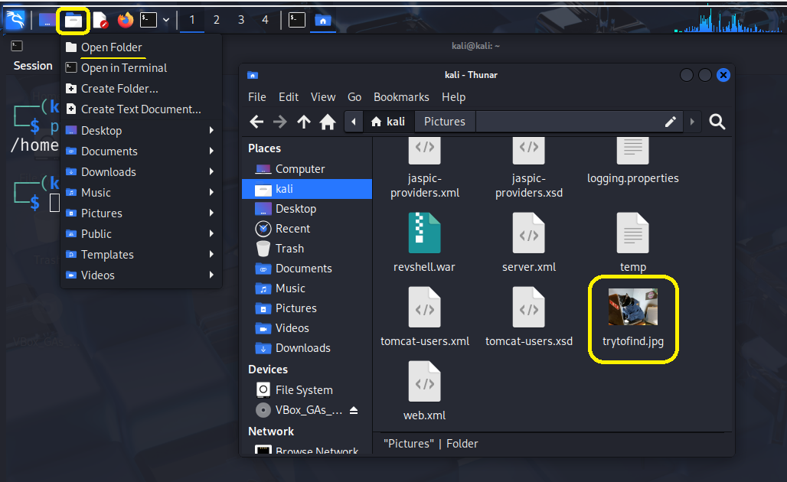

Double‑click the file to view it.<br>
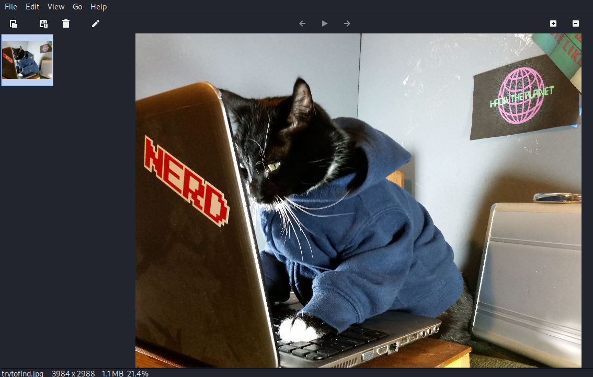

📌 **Result**:
We can see a cat image, which appears unremarkable at first glance.

---

### **Step 6: Explore the web app on port 80**
Open a browser and enter the target’s **IP address**.

📌 **Result**:
The **MoneyBox** HTTP home page loads.<br>
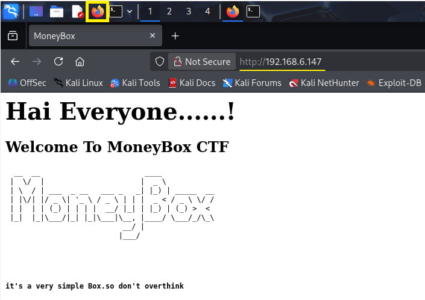

Back in the terminal, run directory brute‑forcing on the (default) port 80 with **dirb**:

```sh
dirb http://192.168.6.147/
```

📌 **Result**:
A hidden directory **blogs** was discovered.<br>
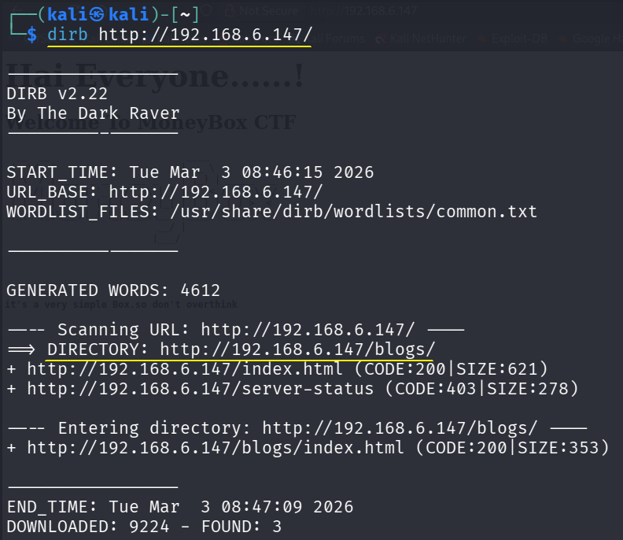

Open the hidden directory **URL** in the browser (http://192.168.6.147/blogs/).<br>
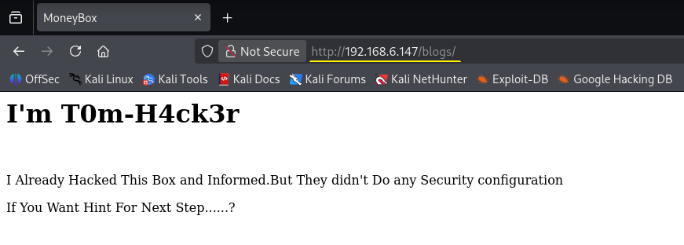

Press **Ctrl+U** to view the page source.<br>
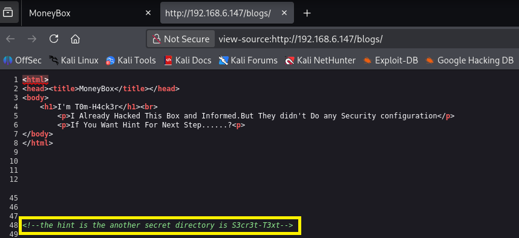

📌 **Result**:
We found a hint for another secret directory (see line 48).
Check it at **http://192.168.6.147/S3ct3r-T3xt**.<br>
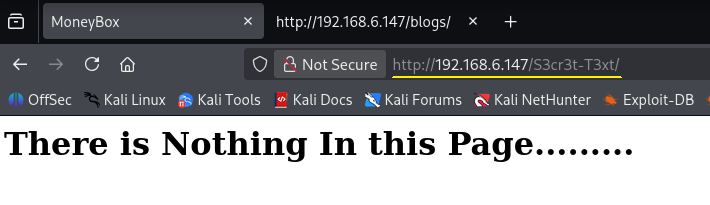

Press **Ctrl+U** again to view the source.<br>
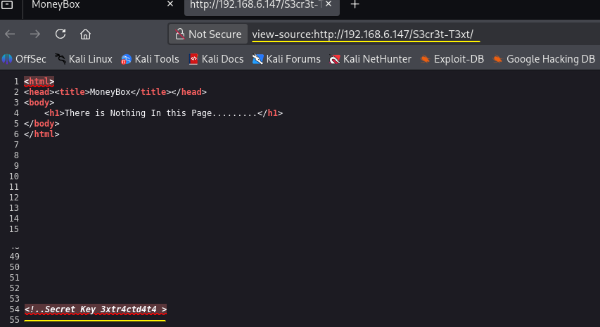

📌 **Result**:
There is a secret key named **"3xtr4ctd4t4"**, which likely means **"extractdata"**.
At this point we have:
- FTP access to the target;
- the downloaded cat image;
- the key **3xtr4ctd4t4** ("extractdata");
- the possibility to log in over SSH, but we still lack a username and password.

---

### **Step 7: Analyze the image and extract hidden data**
We will check the cat image for hidden information using **steganography**.
**Steganography** is a branch of cryptology aimed at hiding the fact that a secret message exists by embedding it into other files without altering their apparent form.
Multimedia files (images, audio, video), office documents, and even text files may be used as containers. Steganography leverages digital containers to transfer messages in a way that is unobtrusive to outsiders.
If nothing obvious is visible, there may still be hidden data. We will use **steghide**, a popular tool for hiding and extracting data in images and audio.
Install it with:

```sh
sudo apt install steghide
```

📌 **Result**:
The extraction tool was installed.<br>
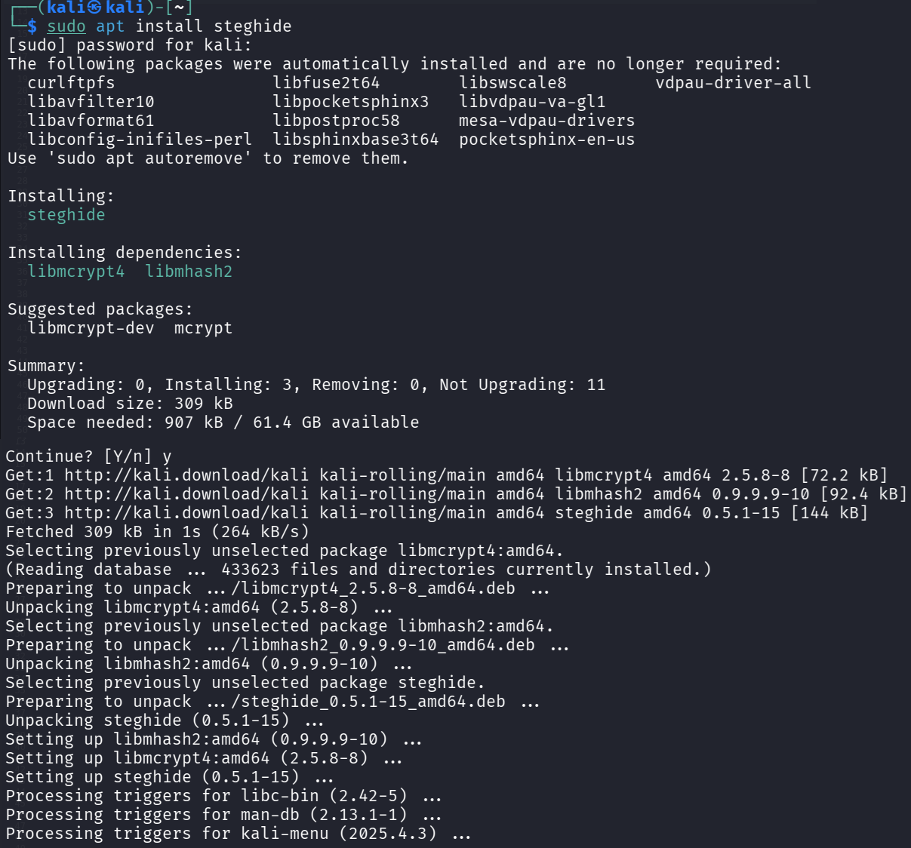

Use **steghide** with these parameters:
- **extract** to attempt retrieving any embedded data;
- **-sf** to specify the suspected stego‑file (**trytofind.jpg**).
If a password is requested, try the key **3xtr4ctd4t4**. Run:

```sh
steghide extract -sf trytofind.jpg
```

📌 **Result**:
The key **3xtr4ctd4t4** worked.
**steghide** reported that hidden data was extracted to **data.txt**.<br>
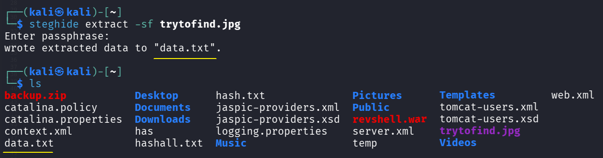

---

### **Step 8: Analyze the extracted hidden data**
Print the contents of **data.txt**:

```sh
cat data.txt
```

📌 **Result**:
The message hints at potential vulnerabilities on the target system and mentions a password that is "too weak" and should be changed.
It is addressed to the user **renu**, which could be a valid system account.<br>
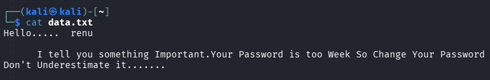

---

### **Step 9: Prepare the wordlist**
A commonly used password list for brute‑forcing is **rockyou**.
On Kali Linux it is typically located in **/usr/share/wordlists/**.
Navigate there and list files:

```sh
cd /usr/share/wordlists
ls
```

📌 **Result**:
If **rockyou.txt** is present, continue to step 10.<br>


If not, the archive **rockyou.txt.gz** can be obtained from the [**danielmiessler**](https://github.com/danielmiessler/SecLists/tree/master/Passwords/Leaked-Databases/) repository on **GitHub**.<br>


Download it from the [link](https://github.com/danielmiessler/SecLists/raw/master/Passwords/Leaked-Databases/rockyou.txt.tar.gz):

```sh
sudo wget https://github.com/danielmiessler/SecLists/raw/master/Passwords/Leaked-Databases/rockyou.txt.tar.gz
```

📌 **Result**:
The **rockyou.txt.tar.gz** archive was downloaded.<br>


List the folder contents:

```sh
ls
```

📌 **Result**:
The **rockyou.txt.gz** archive with the wordlist is present.<br>
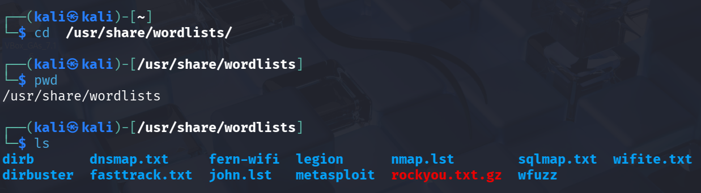

Unpack **rockyou.txt.gz** with **gunzip**:

```sh
gunzip rockyou.txt.gz
ls
```

📌 **Result**:
The **/usr/share/wordlists** folder now contains **rockyou.txt**.<br>


---

### **Step 10: Brute‑force the password for user renu**
We will attempt to brute‑force the SSH password using **hydra** (built‑in to **Kali Linux**).
**Hydra** supports 50+ protocols such as SSH, FTP, HTTP/HTTPS, SMB.
Parameters used:
- **-l renu** — target username;
- **-P /usr/share/wordlists/rockyou.txt** — path to the wordlist;
- **-f** — stop after the first valid login;
- **192.168.6.147** — target IP address;
- **ssh** — target protocol.
- 
```sh
hydra -l renu -P /usr/share/wordlists/rockyou.txt -f 192.168.6.147 ssh .
```

📌 **Result**:
We found the password **987654321** for **renu**.<br>
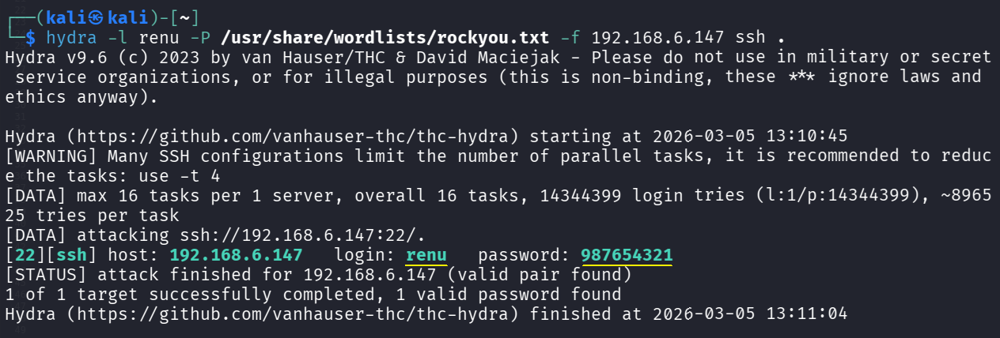

---

### **Step 11: Explore the renu account**
Use the discovered credentials to log in over **SSH** and enter password **987654321** when prompted:

```sh
ssh renu@192.168.6.147
```

📌 **Result**:
Logged in as **renu**. On first login, confirm with **yes**.<br>
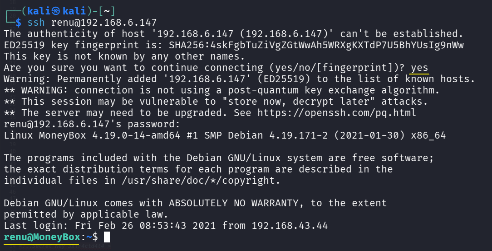

List files in **renu**’s home directory:

```sh
ls
```

📌 **Result**:
Two files are present.<br>
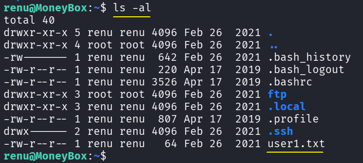

View **user1.txt**:

```sh
cat user1.txt
```

📌 **Result**:
Retrieved a flag file.<br>
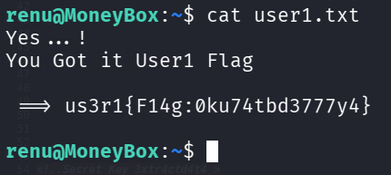

---

### **Step 12: Inspect other users’ files**
Leave **renu**’s home directory and list users:

```sh
cd ..
ls
```

📌 **Result**:
Another user exists — **lily**.<br>
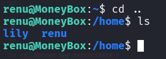

Go to **lily**’s directory and list all files, including hidden ones:

```sh
cd lily
ls -al
```

📌 **Result**:
Noteworthy items: **user1.txt** and the **.ssh** folder.<br>
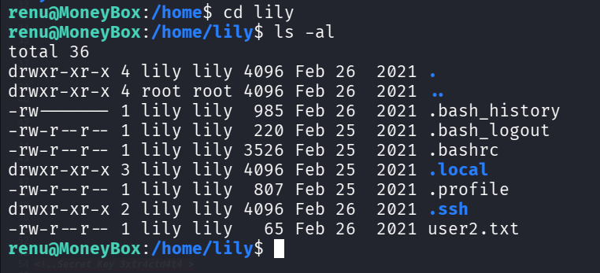

View **user2.txt**:

```sh
cat user2.txt
```

📌 **Result**:
Retrieved another flag file.<br>
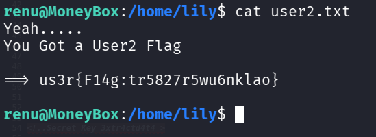

---

### **Step 13: Explore potential privilege escalation paths**
In **lily**’s home, change into **.ssh** and list files:

```sh
cd .ssh
ls
```

📌 **Result**:
The file **authorized_keys** is present.<br>
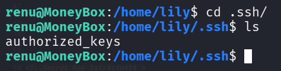

Display **authorized_keys**:
```sh
cat authorized_keys
ls
```

📌 **Result**:
The file contains **renu**’s public key, which means **renu** can log in as **lily**.<br>
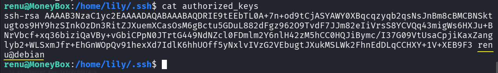

SSH into the system as **lily**:

```sh
ssh lily@192.168.6.147
```

📌 **Result**:
Logged in as **lily** without entering a password (confirm with **yes** on first login).<br>
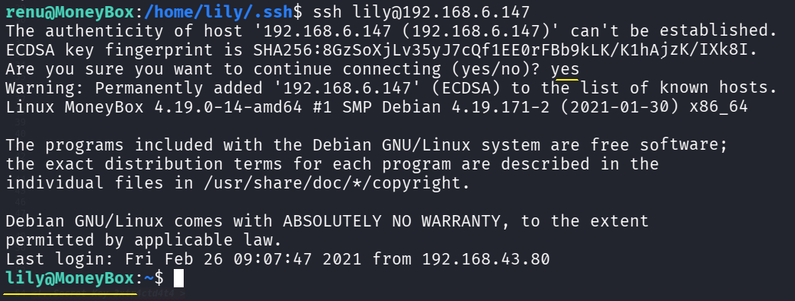

Check **sudo** permissions:

```sh
sudo -l
```

📌 **Result**:
**lily** can run **perl** as **root** via **sudo** without a password.<br>
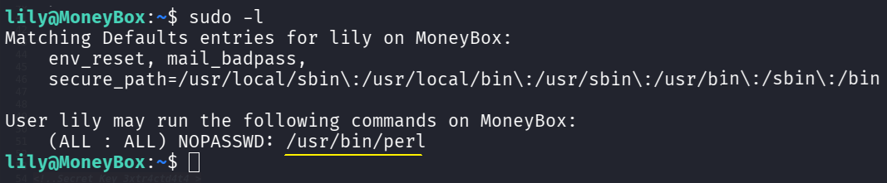

Run **perl** with the following parameters:
- **sudo** executes with root privileges;
- **perl -e** executes inline **Perl** code provided on the command line;
- **'exec "/bin/bash";'** launches a new **/bin/bash** shell as **root**.
Execute:

```sh
sudo perl -e 'exec "/bin/bash";'
```

📌 **Result**:
A **bash** shell with **root** privileges is spawned. Because **NOPASSWD** is set, **sudo** does not prompt **lily** for a password.<br>
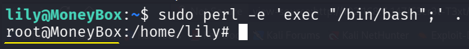

List files in **root**’s home:

```sh
cd ~
ls -al
```

📌 **Result**:
Notable entries: hidden folder **.local** and file **.root.txt**.<br>
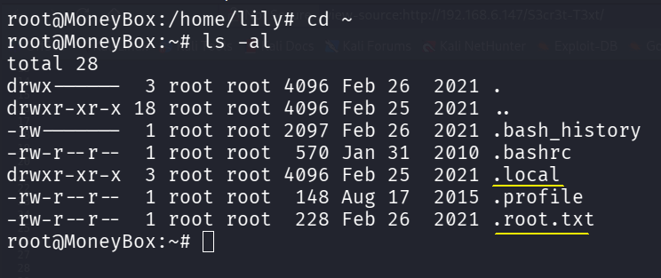

Print **.root.txt**:

```sh
cat .root.txt
```

📌 **Result**:
Retrieved the final flag.<br>
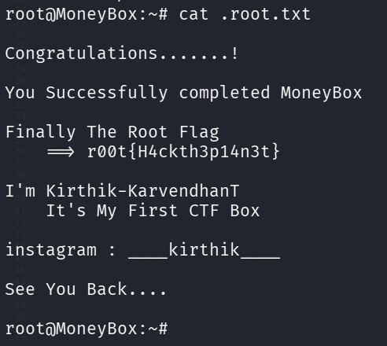

✅ **Final flag captured! CTF completed!** 🎯

---

## **Recommendations**
1. Enforce strong password policies:
   - Use complex and unique passwords for all accounts.
   - Implement multi‑factor authentication to reduce credential‑based attack risk.
2. Avoid storing sensitive data on the target system:
   - Ensure sensitive files are stored securely and encrypted.
   - Avoid placing sensitive files in publicly accessible web directories.
   - Do not leave sensitive data in HTML comments.
3. Restrict access to administrative interfaces:
   - Limit sudo usage; always require a password.
   - Restrict SSH logins between system users.
4. Perform regular security audits:
   - Conduct periodic security assessments to identify and mitigate vulnerabilities.
   - Pay special attention to privilege‑escalation vectors.
   - Review and limit **sudo** privileges to the bare minimum.
5. Implement proper logging and monitoring:
   - Enable comprehensive logging and monitoring across the system.
   - Detect suspicious actions (e.g., unauthorized file access or privilege escalation attempts).

---

## **Conclusion**
- In this step‑by‑step guide, we achieved full access to the **MoneyBox** target by exploring various vulnerabilities and exploitation methods.
- We covered key tasks such as identifying and leveraging weak points, performing privilege escalation, and achieving complete compromise.
- This exercise emphasizes the importance of protecting sensitive files, enforcing strict password policies, and regularly auditing system configurations to prevent unauthorized intrusion.
- By following the steps described, you should now clearly understand how to approach similar problems and apply the tools and methods used here.
- This experience not only strengthens your penetration testing skills but also prepares you for more complex scenarios.
- Following the recommendations can significantly reduce the risk of the described vulnerabilities being exploited in real environments.

**What was accomplished?**
✔️ Identified the target machine’s IP address.
✔️ Scanned ports and services.
✔️ Assessed access via the **FTP service**.
✔️ Downloaded and analyzed an image.
✔️ Investigated **HTTP services**.
✔️ Enumerated the web server’s filesystem.
✔️ Found data enabling access to the target.
✔️ Prepared a password wordlist.
✔️ Retrieved flag files on the target host.
✔️ Obtained **shell access** via SSH.
✔️ Enumerated system user accounts.
✔️ Gained **root access** to the target system.

🔹 **This CTF is a training exercise** to practice **ethical hacking** and penetration testing skills.

## Download the modified virtual machine image [here](https://drive.google.com/file/d/1tfr8JG-c5kOzfbcdMMcBz0ZgM-HHzfvf/view?usp=sharing).
